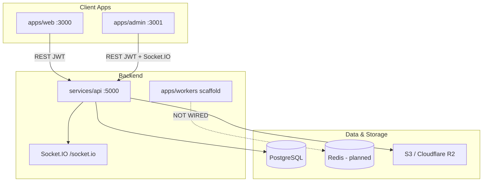
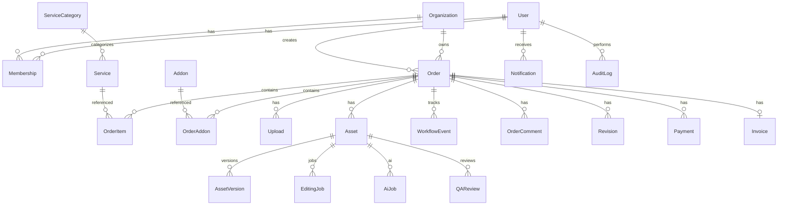
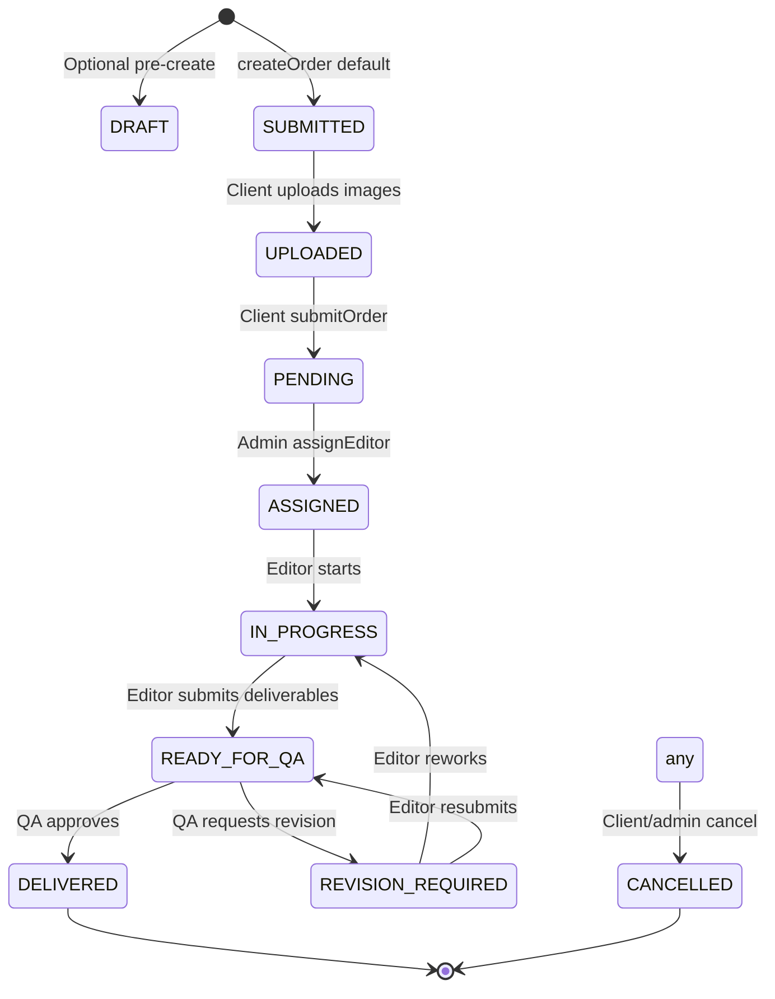
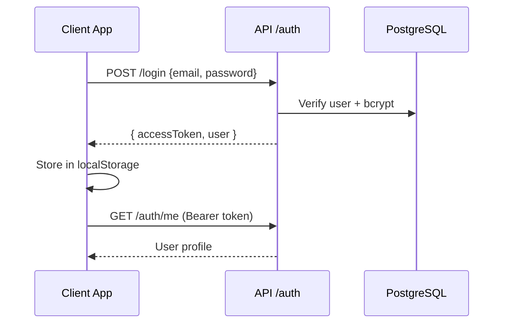

# FOTOPIXELZ — Current Project Status

**Document type:** Technical handover / architecture audit  
**Generated:** July 6, 2026  
**Source of truth:** Current codebase implementation (not prior audit assumptions)  
**Repository:** `C:\Users\Ranje\OneDrive\Desktop\fotopixelz`

---

## SECTION 1 — Executive Summary

### Project Overview

FOTOPIXELZ is a **pnpm + Turbo monorepo** SaaS platform for photo-editing order management. Clients create orders, upload source images, and receive edited deliverables. Internal staff (editors, QA, admins) manage production through a separate admin application.

| Attribute | Value |
|-----------|-------|
| **Monorepo name** | `fotopixelz` v1.0.0 |
| **Package manager** | pnpm 11.4.0 |
| **Primary stack** | Next.js 16 (React 19), Express 5 API, Prisma 7 + PostgreSQL |
| **Apps** | `apps/web` (client), `apps/admin` (operations), `apps/workers` (scaffold) |
| **API** | `services/api` on port **5000** |
| **Auth** | Custom JWT (Bearer token); Clerk listed in deps but **NOT IMPLEMENTED** in runtime auth flow |

### Current Architecture



### Development Stage

| Phase | Status |
|-------|--------|
| Foundation (auth, orgs, schema) | **Complete** |
| Client order + upload flow | **Mostly complete** |
| Admin operations console | **Mostly complete** |
| Deliverable production + QA gates | **Partial** |
| Payments / invoicing | **NOT IMPLEMENTED** (schema only) |
| Background workers / queues | **NOT IMPLEMENTED** (scaffold only) |
| Notifications UI | **NOT IMPLEMENTED** |
| Automated testing | **NOT IMPLEMENTED** |
| Production CI/CD | **NOT IMPLEMENTED** |

### Overall Completion: **~58%**

Weighted by module maturity (core workflow weighted highest).

### Production Readiness: **~38%**

Core happy-path order workflow is demonstrable in dev; payments, workers, monitoring, tests, and several API modules are stubs.

### Major Pending Work

1. Payment processing (Stripe integration exists as client stub only)
2. Full QA / editing / revision API modules (health-only routes)
3. BullMQ worker wiring (Redis queues, email, delivery ZIP)
4. Notification HTTP API + frontend inbox
5. Audit log writes and read API
6. Automated test suite and CI pipeline
7. Production deployment config (beyond dev Docker Compose)
8. Server-side route protection on Next.js apps (currently client-only guards)

### Known Blockers

| Blocker | Impact |
|---------|--------|
| No payment collection at submit | Orders reach `PENDING` with `paymentRequired` flag but no checkout |
| Workers not connected | No async email, ZIP delivery, AI processing |
| JWT in localStorage only | No refresh-token rotation wired; 15m TTL causes session drops |
| `@repo/validators` / `packages/types` unused at runtime | Duplicate validation definitions |
| `packages/ui` directory empty | Planned shared UI never built |

### Known Technical Debt

- Duplicated `lib/*` clients between `apps/web` and `apps/admin`
- Permission matrix in `@repo/auth` not enforced on most API routes (role checks inline per service)
- `AuditLog` model exists; no write path in services
- `EditingJob`, `AiJob`, `QAReview`, `Revision` models exist; minimal service logic
- Legacy integration stubs: Cloudinary, UploadThing in root `package.json` — unused by storage module
- `packages/config/redis.old.ts` — empty legacy file

---

## SECTION 2 — Project Architecture

### Frontend Architecture

| App | Framework | Port | Auth | State |
|-----|-----------|------|------|-------|
| `apps/web` | Next.js 16 App Router | 3000 | `AuthProvider` + `ClientShell` guard | localStorage JWT; `OrganizationProvider` |
| `apps/admin` | Next.js 16 App Router | 3001 | `AuthProvider` + `AdminShell` guard | localStorage JWT; Socket.IO for order rooms |

**No `middleware.ts`** in either app — protection is client-side only.  
**Shared UI package:** `@repo/upload-gallery` (galleries, lightbox, lazy previews).  
**Web UI:** shadcn-style components (`apps/web/src/components/ui/*`).  
**Admin UI:** monolithic `apps/admin/src/components/ui.tsx`.

### Backend Architecture

| Layer | Location | Notes |
|-------|----------|-------|
| Entry | `services/api/src/server.ts` | HTTP + Socket.IO bootstrap |
| App factory | `services/api/src/app.ts` | Express middleware + 21 module routers |
| Modules | `services/api/src/modules/*` | Controller → Service → Prisma pattern |
| Validation | `*.validator.ts` per module | Zod `.safeParse()` in controllers |
| Errors | `services/api/src/common/errors/app-error.ts` | Structured HTTP errors |
| DB client | `@repo/database` → Prisma + `@prisma/adapter-pg` | |

### Database

- **Provider:** PostgreSQL
- **ORM:** Prisma 7 (`prisma/schema.prisma`)
- **Migrations:** 15 applied migrations (`prisma/migrations/`)
- **Seed:** `prisma/seed.ts`

### Prisma

23 models, 19 enums — see Section 7.

### Storage

- **Implementation:** `services/api/src/integrations/storage/`
- **Provider:** `S3CompatibleStorageProvider` — AWS S3 or Cloudflare R2 via `@aws-sdk/client-s3`
- **Config:** `STORAGE_PROVIDER`, bucket/credential env vars (`services/api/src/integrations/storage/config.ts`)
- **Keys:** `services/api/src/integrations/storage/keys.ts`

### Authentication

- **Package:** `packages/auth/`
- **JWT:** `signAccessToken` / `verifyAccessToken` (`packages/auth/tokens.ts`)
- **Middleware:** `requireAuth`, `requireAdmin` (`packages/auth/middleware.ts`)
- **Password:** bcrypt in `auth.service.ts`

### Workers

- **Location:** `apps/workers/`
- **Status:** Scaffold — 10 named queues, 5 jobs, 9 processors; all export `{ status: 'placeholder' }`
- **Dependencies:** `bullmq`, `ioredis` declared but **not imported**

### Notifications

- **Service:** `notifications.service.ts` — CRUD helpers used internally by order-comments
- **Routes:** Health only — **no list/mark-read HTTP API**
- **Triggers:** Comment creation/resolution creates DB notifications for assignees
- **Email:** Resend client stub (`integrations/resend/client.ts`) — **NOT IMPLEMENTED**

### Queues

| Location | Status |
|----------|--------|
| `services/api/src/queues/email.queue.ts` | Placeholder object |
| `services/api/src/queues/ai.queue.ts` | Placeholder object |
| `services/api/src/queues/notification.queue.ts` | Placeholder object |
| `apps/workers/src/queues/registry.ts` | 10 queue names, no BullMQ instances |

### Realtime

- **Socket.IO** on same HTTP server (`services/api/src/sockets/socket.ts`)
- JWT auth on connection
- Rooms: `order:{orderId}`
- Events: `comment.created`, `comment.updated`, `comment.resolved`, `comment.deleted`, `timeline.updated`
- **Consumer:** Admin app only (`apps/admin/src/lib/use-order-socket.ts`)

### Cloud Integrations

| Integration | File | Status |
|-------------|------|--------|
| S3 / R2 | `integrations/storage/s3-compatible-provider.ts` | **IMPLEMENTED** |
| Stripe | `integrations/stripe/client.ts` | Stub |
| Resend | `integrations/resend/client.ts` | Stub |
| Cloudinary | `integrations/cloudinary/client.ts` | Stub (legacy) |
| Redis | `integrations/redis/client.ts` | Stub |
| Replicate | Root `package.json` dep | **NOT USED** in services |

### Third-Party Integrations (package.json root deps)

| Package | Used in runtime code |
|---------|---------------------|
| `@clerk/nextjs` | **NO** |
| `bullmq` / `ioredis` | **NO** (workers scaffold only) |
| `cloudinary` | **NO** |
| `resend` | **NO** |
| `replicate` | **NO** |
| `uploadthing` | **NO** |
| `socket.io` / `socket.io-client` | **YES** (API + admin) |

---

## SECTION 3 — Folder Structure

```
fotopixelz/
├── apps/
│   ├── admin/                    # Staff operations console (Next.js, port 3001)
│   │   ├── src/app/              # App Router pages (login, /admin/*)
│   │   ├── src/components/       # Page-level React components
│   │   ├── src/hooks/            # Order collaboration hooks
│   │   └── src/lib/              # API clients, adapters, access control
│   ├── web/                      # Client workspace (Next.js, port 3000)
│   │   ├── src/app/              # Marketing + dashboard routes
│   │   ├── src/components/       # Auth, order wizard, upload panels
│   │   └── src/lib/              # API clients, workspace helpers
│   └── workers/                  # Background job scaffold (no real processing)
│       └── src/{jobs,processors,queues}/
├── packages/
│   ├── auth/                     # JWT, roles, permissions, guards (@repo/auth)
│   ├── config/                   # Env stubs (stripe, redis, resend) — mostly unused
│   ├── database/                 # Prisma client wrapper (@repo/database)
│   ├── types/                    # DTO interfaces — LEGACY (not imported by apps)
│   ├── ui/                       # EMPTY directories — NOT IMPLEMENTED
│   ├── upload-gallery/           # Shared React galleries (@repo/upload-gallery)
│   ├── utils/                    # Logger, helpers — minimal use
│   └── validators/               # Zod schemas — LEGACY (not used by API)
├── services/
│   └── api/                      # Express REST + Socket.IO API
│       └── src/
│           ├── common/           # Middleware, errors, utils
│           ├── config/           # API env
│           ├── database/         # Prisma re-export
│           ├── integrations/     # S3, stripe, resend, redis, cloudinary
│           ├── modules/          # 21 domain modules
│           ├── queues/           # Placeholder queue defs
│           └── sockets/          # Socket.IO server
├── prisma/
│   ├── schema.prisma             # Canonical data model
│   ├── migrations/               # 15 SQL migrations
│   ├── seed.ts                   # Seed data
│   └── scripts/                  # Repair/cleanup maintenance scripts
├── infrastructure/
│   ├── docker-compose.yml        # Dev stack: postgres, redis, api, web, admin, worker
│   └── docker/                   # Dockerfiles per service
├── docs/                         # architecture.md, local-setup.md, env.md, api.md
├── package.json                  # Root scripts + shared deps
├── pnpm-workspace.yaml
└── turbo.json
```

### Major Folder Purposes

| Folder | Purpose |
|--------|---------|
| `apps/web` | Client-facing SaaS: register, dashboard, order wizard, uploads, deliverable download |
| `apps/admin` | Internal ops: users, orgs, catalog, orders, QA, deliverable upload, realtime comments |
| `apps/workers` | Planned async processing (AI, email, delivery) — scaffold only |
| `services/api` | Single backend: REST `/api/v1/*`, Socket.IO, S3 presigned URLs |
| `packages/auth` | Shared JWT auth for API |
| `packages/database` | Prisma client singleton |
| `packages/upload-gallery` | Only actively shared frontend package |
| `prisma/` | Schema, migrations, maintenance scripts |
| `infrastructure/` | Local Docker dev environment |

**Note:** `services/workers` does **not** exist — workers live under `apps/workers`.

---

## SECTION 4 — Implemented Modules

| Module | Purpose | Status | Implemented Features | Missing Features | Production Ready |
|--------|---------|--------|---------------------|------------------|------------------|
| **Authentication** | User login/register/JWT | **Complete** | Register, login, logout, me, forgot/reset password | Refresh tokens, Clerk, MFA | **Partial** (~70%) |
| **Users** | Profile & billing | **Partial** | GET/PATCH `/users/me`, billing, credits | Avatar, preferences | **Partial** (~60%) |
| **Organizations** | Multi-tenant workspaces | **Complete** | CRUD orgs, memberships | Billing plans beyond DEMO | **Partial** (~65%) |
| **Membership** | Org role assignment | **Complete** | CRUD memberships | Invitation flow | **Partial** (~60%) |
| **Categories** | Service taxonomy | **Complete** | Public list, admin CRUD | — | **Yes** (~80%) |
| **Services** | Editable service catalog | **Complete** | List, admin CRUD, org-scoped | Dynamic pricing rules | **Yes** (~75%) |
| **Addons** | Order add-ons | **Complete** | List, admin CRUD | — | **Yes** (~75%) |
| **Pricing** | Quote calculation | **Partial** | `POST /pricing/quote` | Checkout integration | **Partial** (~50%) |
| **Orders** | Core workflow | **Mostly complete** | CRUD, status, submit, assign editor/QA, revision request | Payment gate, invoice gen | **Partial** (~70%) |
| **Uploads** | Client source images | **Complete** | Presigned PUT, complete, batch, zip, preview, delete | Virus scan, image optimization worker | **Partial** (~75%) |
| **Assets** | Deliverables | **Mostly complete** | Presigned deliverable upload, versions, quota integrity, download | Bulk ZIP download API | **Partial** (~72%) |
| **Workflow** | Audit timeline events | **Partial** | Record events, list by order | Admin activity feed UI (web) | **Partial** (~55%) |
| **Order Comments** | Collaboration | **Complete** | CRUD, attachments, timeline, Socket.IO, notifications (DB) | Web realtime socket | **Partial** (~70%) |
| **Admin** | Staff user management | **Complete** | User CRUD, role/status, staff lists | Audit trail UI | **Partial** (~70%) |
| **QA** | Quality review | **NOT IMPLEMENTED** | Health route only; QA via order status + `QaReviewPanel` UI | Dedicated QAReview API | **No** (~15%) |
| **Editing** | Editor job queue | **NOT IMPLEMENTED** | Health route; `EditingJob` model | Assignment automation | **No** (~10%) |
| **Revisions** | Revision records | **NOT IMPLEMENTED** | Revisions via order status + comments | `Revision` model API | **No** (~20%) |
| **AI** | AI processing | **NOT IMPLEMENTED** | Health route; `AiJob` model | Replicate/provider integration | **No** (~5%) |
| **Payments** | Payment collection | **NOT IMPLEMENTED** | Health route; `Payment` model | Stripe checkout/webhooks | **No** (~5%) |
| **Invoices** | Billing documents | **NOT IMPLEMENTED** | `Invoice` model in schema | Generation API | **No** (~5%) |
| **Notifications** | User alerts | **Partial** | Service helpers; DB writes on comments | HTTP API, UI, email | **No** (~25%) |
| **Analytics** | Reporting | **NOT IMPLEMENTED** | Health route | Dashboards, rollups | **No** (~5%) |
| **Audit Logs** | Compliance trail | **NOT IMPLEMENTED** | Health route; `AuditLog` model | Write/read API | **No** (~5%) |
| **Dashboard (Web)** | Client overview | **Partial** | Demo KPIs, order list entry | Real analytics | **Partial** (~40%) |
| **Dashboard (Admin)** | Ops overview | **Partial** | KPI cards, health checks | Real metrics | **Partial** (~50%) |
| **Settings** | User/org settings | **Partial** | Admin settings page (session info) | Web settings/billing pages are placeholders | **No** (~20%) |
| **Reports** | Business reports | **NOT IMPLEMENTED** | — | — | **No** |
| **Client (Web app)** | End-user app | **Mostly complete** | Full order lifecycle UI | Billing, settings, marketing pages | **Partial** (~55%) |

---

## SECTION 5 — Frontend Pages

### apps/web (19 routes)

| Route | Purpose | Components | APIs | Status |
|-------|---------|------------|------|--------|
| `/` | Marketing landing | `Button`, `Link` | None | **Complete** (minimal) |
| `/login` | Client sign-in | `LoginPage`, `AuthProvider` | `POST /auth/login`, `GET /auth/me` | **Complete** |
| `/register` | Registration | `RegisterPage` | `POST /auth/register` | **Complete** |
| `/pricing` | Pricing info | Inline placeholder | None | **NOT IMPLEMENTED** |
| `/services` | Services index | Inline placeholder | None | **NOT IMPLEMENTED** |
| `/services/*` (7 pages) | Service detail pages | Inline placeholder | None | **NOT IMPLEMENTED** |
| `/dashboard` | Client home | `DemoAccountBanner`, `Card` | `useAuth`, `useOrganization` | **Partial** |
| `/dashboard/orders` | Order list | `Table`, `LoadingBlock` | `GET /orders` | **Complete** |
| `/dashboard/orders/new` | New order | `OrderWizard` | `/categories`, `/services`, `/addons`, `/pricing/quote`, `POST /orders` | **Complete** |
| `/dashboard/orders/[orderId]` | Order detail | `OrderUploadPanel`, `OrderStatusTimeline`, `ClientOrderComments`, `OrderDeliverables` | `/orders/:id`, uploads, assets, comments | **Complete** |
| `/dashboard/assets` | Asset library | `Table` | `GET /assets`, download URLs | **Complete** |
| `/dashboard/billing` | Billing | Placeholder | None | **NOT IMPLEMENTED** |
| `/dashboard/settings` | Settings | Placeholder | None | **NOT IMPLEMENTED** |

### apps/admin (20 routes)

| Route | Purpose | Components | APIs | Status |
|-------|---------|------------|------|--------|
| `/` | Redirect | `redirect('/admin')` | None | **Complete** |
| `/login` | Staff login | `AuthPage` | `/auth/login` | **Complete** |
| `/forgot-password` | Reset request | `AuthPage` | `/auth/forgot-password` | **Complete** |
| `/reset-password` | Password reset | `AuthPage` | `/auth/reset-password` | **Complete** |
| `/admin` | Ops dashboard | `DashboardOverview` | `/orders`, `/uploads`, `/assets`, `/organizations`, health endpoints | **Partial** |
| `/admin/orders` | Order management | `OrdersPage` | Full orders API | **Complete** |
| `/admin/orders/[orderId]` | Production workspace | `OrderDetailPage`, `OrderProductionWorkspace`, `QaReviewPanel`, comments/timeline | Orders, uploads, assets, workflow, comments, socket | **Complete** |
| `/admin/uploads` | Upload admin | `UploadsPage` | Full uploads API | **Complete** |
| `/admin/assets` | Deliverable list | `AssetsPage` | `GET /assets`, `DELETE` | **Complete** |
| `/admin/assets/[assetId]` | Asset detail | `AssetDetailPage` | Asset + versions + download | **Complete** |
| `/admin/users` | All users | `PeoplePage` | `/admin/users/*` | **Complete** |
| `/admin/clients` | Clients | `PeoplePage` | `/admin/users/clients` | **Complete** |
| `/admin/editors` | Editors | `PeoplePage` | `/admin/users/editors` | **Complete** |
| `/admin/qa` | QA queue or QA users | `OrdersPage` / `PeoplePage` | Role-dependent | **Complete** |
| `/admin/categories` | Categories CRUD | `CatalogPage` | `/categories` | **Complete** |
| `/admin/addons` | Addons CRUD | `CatalogPage` | `/addons` | **Complete** |
| `/admin/services` | Services CRUD | `ServicesPage` | `/services`, `/categories` | **Complete** |
| `/admin/organizations` | Org management | `OrganizationsPage` | `/organizations/*` | **Complete** |
| `/admin/settings` | Session info | `SettingsPage` | `useAuth` only | **Partial** |
| `/admin/profile` | Staff profile | `ProfilePage` | `/users/me`, billing, credits | **Complete** |

---

## SECTION 6 — API Documentation

**Base URL:** `/api/v1`  
**Auth header:** `Authorization: Bearer <accessToken>`  
**Validation:** Zod schemas in `*.validator.ts`, parsed in controllers  
**Global middleware:** `cors`, `helmet`, `morgan`, `express.json`, `errorHandler`

### Root

| Method | URL | Controller | Service | Auth | Roles | Request | Response | Errors |
|--------|-----|------------|---------|------|-------|---------|----------|--------|
| GET | `/health` | inline `app.ts` | — | None | — | — | `{ status: 'ok' }` | — |

---

### Auth — `/api/v1/auth`

| Method | URL | Controller | Service | Validator | Auth | Roles |
|--------|-----|------------|---------|-----------|------|-------|
| GET | `/health` | `getAuthHealth` | `getAuthStatus` | — | None | — |
| POST | `/register` | `registerHandler` | `registerUser` | `registerSchema` | None | Public |
| POST | `/login` | `loginHandler` | `loginUser` | `loginSchema` | None | Public |
| POST | `/forgot-password` | `forgotPasswordHandler` | `forgotPassword` | `forgotPasswordSchema` | None | Public |
| POST | `/reset-password` | `resetPasswordHandler` | `resetPassword` | `resetPasswordSchema` | None | Public |
| GET | `/me` | `meHandler` | `getCurrentUser` | — | `requireAuth` | Any authenticated |
| POST | `/logout` | `logoutHandler` | — | — | `requireAuth` | Any authenticated |

**Business logic:** Register creates user + optional org workspace (`auth/client-workspace.ts`). Login returns JWT access token. Password reset uses token + expiry on `User` model.

---

### Users — `/api/v1/users` (router-level `requireAuth` after `/health`)

| Method | URL | Controller | Service | Validator |
|--------|-----|------------|---------|-----------|
| GET | `/health` | `getUsersHealth` | `getUsersStatus` | — |
| GET | `/me` | `getMeHandler` | `getMe` | — |
| PATCH | `/me` | `updateMeHandler` | `updateMe` | `updateMeSchema` |
| GET | `/me/billing` | `getMyBillingHandler` | `getMyBilling` | — |
| PATCH | `/me/billing` | `updateMyBillingHandler` | `updateMyBilling` | `updateMyBillingSchema` |
| GET | `/me/credits` | `getMyCreditsHandler` | `getMyCredits` | — |

---

### Organizations — `/api/v1/organizations`

| Method | URL | Service fn | Auth | Notes |
|--------|-----|------------|------|-------|
| GET | `/health` | health | None | |
| GET | `/` | `listOrganizations` | `requireAuth` | Scoped to user's memberships |
| POST | `/` | `createOrganization` | `requireAuth` | |
| GET | `/:organizationId` | `getOrganization` | `requireAuth` | |
| PATCH | `/:organizationId` | `updateOrganization` | `requireAuth` | Admin/member rules in service |
| DELETE | `/:organizationId` | `deleteOrganization` | `requireAuth` | |
| GET | `/:organizationId/memberships` | `listMemberships` | `requireAuth` | |
| POST | `/:organizationId/memberships` | `createMembership` | `requireAuth` | |
| PATCH | `/:organizationId/memberships/:membershipId` | `updateMembership` | `requireAuth` | |
| DELETE | `/:organizationId/memberships/:membershipId` | `deleteMembership` | `requireAuth` | |

---

### Categories — `/api/v1/categories`

| Method | URL | Auth | Roles |
|--------|-----|------|-------|
| GET | `/health` | None | — |
| GET | `/` | None | Public read |
| GET | `/:id` | None | Public read |
| POST | `/` | `requireAuth` + `requireAdmin` | ADMIN, SUPER_ADMIN |
| PATCH | `/:id` | `requireAuth` + `requireAdmin` | ADMIN, SUPER_ADMIN |
| DELETE | `/:id` | `requireAuth` + `requireAdmin` | ADMIN, SUPER_ADMIN |

---

### Addons — `/api/v1/addons`

| Method | URL | Auth | Roles |
|--------|-----|------|-------|
| GET | `/` | None | Public read |
| GET | `/:id` | None | Public read |
| POST | `/` | `requireAuth` + `requireAdmin` | ADMIN, SUPER_ADMIN |
| PATCH | `/:id` | `requireAuth` + `requireAdmin` | ADMIN, SUPER_ADMIN |
| DELETE | `/:id` | `requireAuth` + `requireAdmin` | ADMIN, SUPER_ADMIN |

---

### Services — `/api/v1/services`

Same pattern as Categories (public GET, admin write).

---

### Orders — `/api/v1/orders` (entire router `requireAuth`)

| Method | URL | Service | Key business logic |
|--------|-----|---------|-------------------|
| GET | `/health` | health | |
| POST | `/` | `createOrder` | CLIENT/ADMIN creates; status `SUBMITTED`; generates `orderNumber` |
| GET | `/` | `listOrders` | Role-scoped filters (client sees own org, editor assigned, etc.) |
| PATCH | `/status` | `updateOrderStatus` | Role-gated transitions; deliverable count checks for QA/delivery |
| PATCH | `/assign-editor` | `assignEditor` | ADMIN only; `PENDING` → `ASSIGNED` |
| PATCH | `/assign-qa` | `assignQa` | ADMIN only |
| POST | `/request-revision` | `requestOrderRevision` | QA/ADMIN; creates revision comment |
| POST | `/:id/submit` | `submitOrder` | CLIENT only; `UPLOADED` → `PENDING`; applies credits |
| GET | `/:id` | `getOrder` | Org/role access check |
| PATCH | `/:id` | `updateOrder` | Pre-upload edits |
| DELETE | `/:id` | `deleteOrder` | ADMIN soft-delete (`isDeleted`) |

**Status transition enforcement:** `order-status-transitions.ts` for EDITOR/QA; admins bypass matrix.

---

### Uploads — `/api/v1/uploads` (entire router `requireAuth`)

| Method | URL | Service | Purpose |
|--------|-----|---------|---------|
| GET | `/health` | health | |
| POST | `/batch` | `createBatchUploads` | Multi-file metadata records |
| POST | `/zip` | `createZipUpload` | ZIP archive upload flow |
| POST | `/presigned-url` | `createPresignedUrl` | S3/R2 presigned PUT for source image |
| POST | `/complete` | `completeUpload` | Mark upload UPLOADED; may set order UPLOADED |
| POST | `/` | `createUpload` | Direct metadata create |
| GET | `/` | `listUploads` | Paginated list |
| GET | `/order/:orderId` | `listUploadsByOrder` | Per-order source files |
| GET | `/:id/preview-url` | `getUploadPreviewUrl` | Presigned GET |
| GET | `/:id` | `getUpload` | Single record |
| DELETE | `/:id` | `deleteUpload` | Soft delete + storage cleanup |

---

### Assets — `/api/v1/assets` (entire router `requireAuth`)

| Method | URL | Service | Purpose |
|--------|-----|---------|---------|
| GET | `/health` | health | |
| POST | `/presigned-url` | `createDeliverablePresignedUrl` | Quota check via `deliverable-integrity.ts` |
| POST | `/complete` | `completeDeliverableUpload` | PENDING → READY |
| POST | `/` | `createAsset` | Direct asset create |
| GET | `/` | `listAssets` | Filtered list |
| GET | `/:assetId/download-url` | `getAssetDownloadUrl` | Presigned GET |
| GET | `/:assetId/versions` | `listAssetVersions` | Version history |
| POST | `/:assetId/versions` | `createAssetVersion` | New version row |
| PATCH | `/:assetId/versions/:versionId` | `updateAssetVersion` | |
| DELETE | `/:assetId/versions/:versionId` | `deleteAssetVersion` | Soft delete |
| GET | `/:assetId` | `getAsset` | |
| PATCH | `/:assetId` | `updateAsset` | |
| DELETE | `/:assetId` | `deleteAsset` | Soft archive; abandoned PENDING cleanup (BUG-003.2) |

---

### Order Comments — `/api/v1/order-comments`

| Method | URL | Service | Realtime |
|--------|-----|---------|----------|
| GET | `/health` | health | |
| GET | `/orders/:orderId` | `listOrderComments` | — |
| GET | `/orders/:orderId/timeline` | `listOrderTimeline` | Merges comments + workflow events |
| POST | `/` | `createOrderComment` | Emits `comment.created`, `timeline.updated` |
| POST | `/attachment/presigned-url` | `createCommentAttachmentPresigned` | |
| GET | `/:commentId/attachment/download-url` | `getCommentAttachmentDownload` | |
| PATCH | `/:commentId` | `updateOrderComment` | Emits `comment.updated` |
| DELETE | `/:commentId` | `deleteOrderComment` | Emits `comment.deleted` |

---

### Admin — `/api/v1/admin` (`requireAuth` + `requireAdmin` after health)

| Method | URL | Service |
|--------|-----|---------|
| GET | `/health` | health |
| POST | `/users` | `createStaffUser` |
| GET | `/users` | `listUsers` |
| GET | `/users/editors` | `listEditors` |
| GET | `/users/qa` | `listQa` |
| GET | `/users/clients` | `listClients` |
| GET | `/users/:id` | `getUserById` |
| PATCH | `/users/:id` | `updateUser` |
| DELETE | `/users/:id` | `deleteUser` |
| PATCH | `/users/:id/role` | `updateUserRole` |
| PATCH | `/users/:id/status` | `updateUserStatus` |

---

### Workflow — `/api/v1/workflow`

| Method | URL | Service |
|--------|-----|---------|
| GET | `/health` | health |
| GET | `/orders/:orderId/events` | `listOrderWorkflowEvents` |

---

### Pricing — `/api/v1/pricing`

| Method | URL | Auth | Service |
|--------|-----|------|---------|
| GET | `/health` | None | health |
| POST | `/quote` | `requireAuth` | `buildQuote` |

---

### Health-Only Stub Modules

These modules expose **only** `GET /health` — no business endpoints:

| Module | URL prefix | Controller |
|--------|------------|------------|
| AI | `/api/v1/ai` | `getAiHealth` |
| Editing | `/api/v1/editing` | `getEditingHealth` |
| QA | `/api/v1/qa` | `getQaHealth` |
| Revisions | `/api/v1/revisions` | `getRevisionsHealth` |
| Payments | `/api/v1/payments` | `getPaymentsHealth` |
| Notifications | `/api/v1/notifications` | `getNotificationsHealth` |
| Analytics | `/api/v1/analytics` | `getAnalyticsHealth` |
| Audit Logs | `/api/v1/audit-logs` | `getAuditLogsStatus` |

**Total HTTP endpoints: 108** (1 root + 107 module routes)

---

## SECTION 7 — Database

### ER Overview



### Prisma Models (23)

| Model | Table purpose |
|-------|---------------|
| `User` | Accounts with `UserRole`, password, reset tokens |
| `UserBillingProfile` | Client billing address/tax |
| `Organization` | Tenant; demo plan, credits, subscription fields |
| `Membership` | User ↔ Org with `MembershipRole` |
| `ServiceCategory` | Catalog grouping |
| `Addon` | Optional order add-ons |
| `Service` | Editable services with pricing |
| `Order` | Central workflow entity |
| `OrderItem` | Line items (service × qty) |
| `OrderAddon` | Selected addons per order |
| `Asset` | Deliverable files (versioned, review rounds) |
| `AssetVersion` | Historical file versions per asset |
| `Upload` | Client source images |
| `EditingJob` | Per-asset editor assignment — **minimal runtime use** |
| `AiJob` | AI processing jobs — **NOT IMPLEMENTED** |
| `QAReview` | QA records — **NOT IMPLEMENTED** |
| `Revision` | Revision requests — partial via order flow |
| `Payment` | Payments — **NOT IMPLEMENTED** |
| `Invoice` | Invoices — **NOT IMPLEMENTED** |
| `Notification` | In-app notifications |
| `AuditLog` | Audit trail — **no writes** |
| `WorkflowEvent` | Order lifecycle event log |
| `OrderComment` | Threaded comments with attachments |

### Enums (19)

`UserRole`, `MembershipRole`, `OrganizationPlan`, `SubscriptionStatus`, `OrderStatus`, `AssetStatus`, `StorageProvider`, `UploadStatus`, `OrderPriority`, `EditingJobStatus`, `AiJobStatus`, `QAStatus`, `RevisionStatus`, `PaymentStatus`, `NotificationType`, `WorkflowEventType`, `CommentType`, `CommentStatus`, `AddonPricingType`

### Key Indexes

- `Order`: `(organizationId, status)`, `orderNumber`, `(assignedEditorId, status)`, `(assignedQaId, status)`
- `Asset`: `(orderId, isCurrent)`, `(orderId, reviewRound)`, `(orderId, version)`
- `Upload`: `(organizationId, status)`, `(orderId)`
- `OrderComment`: `(orderId, createdAt)`, `(orderId, status)`
- `WorkflowEvent`: `(orderId, createdAt)`, `(orderId, eventType)`

### Migrations (15)

| Migration | Summary |
|-----------|---------|
| `20260529100719_init` | Initial User, Order, Upload, AiJob |
| `20260530123542_organization_order_asset_foundation` | Full domain expansion |
| `20260531114712_add_password_reset_fields` | Password reset |
| `20260531192608_add_user_billing_profile` | Billing profile |
| `20260602000000_add_addons` | Addon catalog |
| `20260602010000_add_uploads` | Upload model |
| `20260602020000_module_7_orders` | Order workflow enums |
| `20260602030000_module_8_assets` | Asset module |
| `20260602040000_order_item_subtotal` | OrderItem.subtotal |
| `20260602050000_pricing_module` | OrderAddon, pricing types |
| `20260606050000_client_demo_workspace` | Org credits/plan |
| `20260606120000_workflow_event_lifecycle` | WorkflowEvent types |
| `20260606140000_deliverable_versioning` | reviewRound, isCurrent, replacesAssetId |
| `20260606180000_order_comments_collaboration` | OrderComment |
| `20260606200000_order_number_and_submitted_status` | orderNumber, SUBMITTED |

### Important Business Rules (enforced in code)

1. **Deliverable quota:** `existingDeliverables + pendingUploads + new ≤ sourceImageCount` (`deliverable-integrity.ts`)
2. **QA submit:** Editor must have ≥1 READY deliverable matching source count before `READY_FOR_QA`
3. **Delivery:** QA/admin must pass source↔deliverable count match
4. **Submit order:** CLIENT only from `UPLOADED` with ≥1 upload; deducts org credits
5. **Editor assign:** Only from `PENDING` status
6. **Revision:** Increments `reviewRound`, archives current deliverables' `isCurrent`
7. **Soft deletes:** Orders and assets use `isDeleted` flag

---

## SECTION 8 — Business Workflow

### End-to-End Flow



### Status Transition Matrix

| From | To | Who | Mechanism |
|------|-----|-----|-----------|
| `SUBMITTED` | `UPLOADED` | CLIENT | Upload complete / `PATCH /orders/status` |
| `UPLOADED` | `PENDING` | CLIENT | `POST /orders/:id/submit` |
| `PENDING` | `ASSIGNED` | ADMIN | `PATCH /orders/assign-editor` |
| `ASSIGNED` | `IN_PROGRESS` | EDITOR | `PATCH /orders/status` |
| `IN_PROGRESS` | `READY_FOR_QA` | EDITOR | `PATCH /orders/status` + deliverable checks |
| `READY_FOR_QA` | `DELIVERED` | QA/ADMIN | `PATCH /orders/status` + count match |
| `READY_FOR_QA` | `REVISION_REQUIRED` | QA | `POST /orders/request-revision` |
| `REVISION_REQUIRED` | `IN_PROGRESS` | EDITOR | `PATCH /orders/status` |
| `REVISION_REQUIRED` | `READY_FOR_QA` | EDITOR | `PATCH /orders/status` |
| Any (client) | `CANCELLED` | CLIENT | `PATCH /orders/status` |
| Any | `*` | ADMIN/SUPER_ADMIN | Bypass transition matrix |

### Workflow Events Recorded

`WorkflowEventType` enum — written via `workflow.service.ts` on status changes, assignments, uploads, comments.

---

## SECTION 9 — Role Permissions

### Platform Roles (`UserRole`)

Defined in `packages/auth/permissions.ts` and enforced variously in services + frontend `access-control.ts`.

| Permission | CLIENT | EDITOR | QA | ADMIN | SUPER_ADMIN |
|------------|:------:|:------:|:--:|:-----:|:-----------:|
| orders:create | ✓ | | | ✓ | ✓ |
| orders:read | ✓ | ✓ | ✓ | ✓ | ✓ |
| orders:update | | | | ✓ | ✓ |
| orders:assign | | | | ✓ | ✓ |
| uploads:create/read | ✓ | | | ✓ | ✓ |
| assets:read | ✓ | ✓ | ✓ | ✓ | ✓ |
| assets:update | | ✓ | | ✓ | ✓ |
| assets:deliver | | | | ✓ | ✓ |
| editing:update | | ✓ | | ✓ | ✓ |
| qa:review/approve/reject | | | ✓ | ✓ | ✓ |
| payments:* | read | | | ✓ | ✓ |
| admin:access | | | | ✓ | ✓ |
| settings:update | | | | ✓ | ✓ |

### Frontend Route Access

| Role | Web app | Admin app paths |
|------|---------|-----------------|
| CLIENT | `/dashboard/*` only | Blocked |
| EDITOR | Blocked | `/admin`, orders, uploads, assets, profile |
| QA | Blocked | `/admin`, qa, orders, assets, profile |
| ADMIN | Blocked | Full admin except SUPER_ADMIN user mgmt rules |
| SUPER_ADMIN | Blocked | Full admin |

### Membership Roles (`MembershipRole`)

Org-scoped: `OWNER`, `ADMIN`, `CLIENT`, `EDITOR`, `QA`, `SUPER_ADMIN` — used for org membership CRUD; platform `UserRole` drives API authorization.

---

## SECTION 10 — Authentication

### JWT Flow



| Setting | Env var | Default |
|---------|---------|---------|
| Secret | `JWT_ACCESS_SECRET` | Required |
| TTL | `JWT_ACCESS_TTL` | `15m` |
| Refresh | `JWT_REFRESH_SECRET`, `JWT_REFRESH_TTL` | Defined in `.env.example` — **NOT IMPLEMENTED** in auth service |

### Middleware

| Function | File | Behavior |
|----------|------|----------|
| `requireAuth` | `packages/auth/middleware.ts` | Parses Bearer JWT, sets `req.userId`, `req.role` |
| `requireAdmin` | `packages/auth/middleware.ts` | Requires ADMIN or SUPER_ADMIN |

### Protected Routes

- **API:** Per-route `requireAuth` on routers (orders, uploads, assets fully protected)
- **Frontend:** `ClientShell` / `AdminShell` redirect unauthenticated users — **no server middleware**

### Token Storage

| App | Keys |
|-----|------|
| Web | `fotopixelz.web.accessToken`, `.user`, `.organization` |
| Admin | `fotopixelz.admin.accessToken`, `.user` |

---

## SECTION 11 — Storage

### S3 / R2 Implementation

| Concern | Implementation |
|---------|----------------|
| Provider selection | `STORAGE_PROVIDER` = `S3` or `R2` |
| Upload | Presigned PUT (`createPresignedPutUrl`) |
| Download | Presigned GET (`createPresignedGetUrl`) |
| Delete | `DeleteObjectCommand` |
| Public URL | Optional `*_PUBLIC_URL` or default S3/R2 URL |

### Presigned Upload Flows

| Flow | Endpoints | Creates |
|------|-----------|---------|
| Source image | `POST /uploads/presigned-url` → PUT → `POST /uploads/complete` | `Upload` record |
| Deliverable | `POST /assets/presigned-url` → PUT → `POST /assets/complete` | `Asset` (PENDING→READY) |
| Comment attachment | `POST /order-comments/attachment/presigned-url` | Storage key on comment |

### Asset Lifecycle

| Status | Meaning |
|--------|---------|
| `PENDING` | Presigned created, upload in progress or abandoned |
| `READY` | Upload complete, awaiting QA/delivery |
| `DELIVERED` | Order delivered; asset marked delivered |
| `ARCHIVED` | Legacy status in enum — soft-delete uses `isDeleted` |
| `PROCESSING` | Enum value — limited runtime use |

### Versions

- `Asset.version` + `AssetVersion` table for historical files
- `Order.deliverableVersion` + `Asset.reviewRound` scope active batch
- `isCurrent` flag marks active deliverable per source slot
- `replacesAssetId` links replacement deliverables

### Replace Flow

Admin uploads new deliverable with `replacesAssetId` → old asset archived, new PENDING→READY.

### Archive Flow

`DELETE /assets/:id` → soft archive (`isDeleted: true`); triggers abandoned PENDING cleanup in same batch.

### Pending Flow (BUG-003.2)

- Failed client upload deletes orphan PENDING via `asset-client.ts`
- Cancel pending UI in `deliverable-upload-panel.tsx`
- Server cleanup on READY delete via `cleanupAbandonedPendingDeliverables()`

---

## SECTION 12 — Background Workers

### Workers (`apps/workers`)

| Component | Count | Status |
|-----------|-------|--------|
| Queue registry | 10 names | Placeholder |
| Jobs | 5 files | Placeholder |
| Processors | 9 files | Placeholder |
| Cron jobs | 0 | **NOT IMPLEMENTED** |

### Planned Queues (registry only)

`ai-processing`, `image-upload`, `image-optimization`, `editor-assignment`, `qa-review`, `revision-request`, `delivery`, `email-notification`, `payment-webhook`, `analytics-rollup`

### Events

No event bus — workflow events written synchronously to PostgreSQL.

### Missing Implementation

- BullMQ Worker/Queue instantiation
- Redis connection
- Email sending via Resend
- ZIP bundle generation for "Download All"
- AI job dispatch to Replicate
- Payment webhook processing
- Analytics rollup cron

---

## SECTION 13 — Notifications

| Aspect | Status |
|--------|--------|
| Database model | **IMPLEMENTED** (`Notification`) |
| Service functions | **IMPLEMENTED** (`createNotification`, `listUserNotifications`, `markNotificationRead`) |
| HTTP API | **NOT IMPLEMENTED** (health only) |
| Triggers | Comment create/resolve → `createNotificationsForUsers` in `order-comments.service.ts` |
| Realtime | **NOT IMPLEMENTED** for notifications (comments use Socket.IO) |
| Email | **NOT IMPLEMENTED** |
| Frontend UI | **NOT IMPLEMENTED** (no inbox in web or admin) |

---

## SECTION 14 — Comments & Timeline

### Comments (`OrderComment`)

- Threaded via `parentId`
- Types: `GENERAL`, `REVISION`, `CLIENT_FEEDBACK`, `QA_NOTE`, `INTERNAL_NOTE`, `SYSTEM`
- Status: `OPEN`, `IN_PROGRESS`, `RESOLVED`
- Attachments via presigned upload
- Role restrictions in `order-comments.service.ts` (`assertCommentTypeAllowed`)

### Timeline

- `GET /order-comments/orders/:orderId/timeline` merges `OrderComment` + `WorkflowEvent` chronologically
- Admin: `OrderTimelinePanel` + `workflow-events.ts` labels
- Web: `OrderStatusTimeline` (status-focused, not full API timeline)

### Activity / Audit

- `WorkflowEvent` — **IMPLEMENTED** (write + read)
- `AuditLog` — model only, **no service writes**

### Duplicate Logic

| Area | Duplication |
|------|-------------|
| `order-comments-client.ts` | Separate copies in web (subset) and admin (full) |
| `download-utils.ts` | Identical in both apps |
| `access-control.ts` | Parallel web/admin copies |
| Timeline display | Web uses status timeline component; admin uses API timeline — different data sources |
| Workflow labels | `packages/types/workflow.ts` vs `apps/admin/src/lib/workflow-events.ts` |

---

## SECTION 15 — Completed Bugs

| Item | Status | Evidence |
|------|--------|----------|
| **BUG-001** — Deliverable `isCurrent` / pagination | **Completed** | `prisma/scripts/repair-deliverable-is-current.ts`; deliverable versioning migration; verification report |
| **BUG-003** — Deliverable integrity safeguards | **Completed** | `deliverable-integrity.ts`; QA/delivery count checks in `orders.service.ts` |
| **BUG-003.1** — Boundary validation (`<=` quota) | **Completed** | `assertCanAddDeliverables` in `deliverable-integrity.ts`; error messages include pending count |
| **BUG-003.2** — Pending upload cleanup | **Completed** | `asset-client.ts` failure cleanup; `assets.service.ts` abandoned PENDING cleanup; cancel UI in `deliverable-upload-panel.tsx` |
| **Port stabilization** | **Completed** | `apps/web/package.json`: `next dev -p 3000`; `apps/admin/package.json`: `next dev -p 3001` |
| **Environment stabilization** | **Partial** | Ports fixed; JWT secret mismatch, Turbopack, mixed Docker/local still documented risks in `FOTOPIXELZ_DEV_ENVIRONMENT_AUDIT_REPORT.md` |

---

## SECTION 16 — Current APIs Matrix

| Module | API Prefix | Endpoints | Status | Used By (Frontend) | Used By (Backend) | Production Ready |
|--------|------------|-----------|--------|-------------------|-------------------|------------------|
| Root | `/health` | 1 | Live | Admin health dashboard | — | Yes |
| Auth | `/auth` | 7 | Live | Web, Admin | All modules | Partial |
| Users | `/users` | 6 | Live | Admin profile | — | Partial |
| Organizations | `/organizations` | 10 | Live | Web, Admin | Orders | Partial |
| Categories | `/categories` | 6 | Live | Web wizard, Admin | Orders | Yes |
| Addons | `/addons` | 5 | Live | Web wizard, Admin | Pricing | Yes |
| Services | `/services` | 6 | Live | Web wizard, Admin | Orders | Yes |
| Orders | `/orders` | 11 | Live | Web, Admin | Workflow, comments | Partial |
| Uploads | `/uploads` | 11 | Live | Web, Admin | Assets quota | Partial |
| Assets | `/assets` | 13 | Live | Web, Admin | Orders QA gates | Partial |
| Order Comments | `/order-comments` | 8 | Live | Web (subset), Admin | Notifications | Partial |
| Admin | `/admin` | 11 | Live | Admin | — | Partial |
| Workflow | `/workflow` | 2 | Live | Admin | Order-comments timeline | Partial |
| Pricing | `/pricing` | 2 | Live | Web wizard | Orders create | Partial |
| AI | `/ai` | 1 | Stub | — | — | No |
| Editing | `/editing` | 1 | Stub | — | — | No |
| QA | `/qa` | 1 | Stub | — | — | No |
| Revisions | `/revisions` | 1 | Stub | — | — | No |
| Payments | `/payments` | 1 | Stub | — | — | No |
| Notifications | `/notifications` | 1 | Stub | — | order-comments (internal) | No |
| Analytics | `/analytics` | 1 | Stub | — | — | No |
| Audit Logs | `/audit-logs` | 1 | Stub | — | — | No |

---

## SECTION 17 — Reusable Components

### `@repo/upload-gallery` (shared package)

| Component | Used In |
|-----------|---------|
| `SourceUploadGallery` | Web `order-upload-panel.tsx`; Admin `order-production-workspace.tsx` |
| `DeliverableGallery` | Admin `qa-review-panel.tsx` |
| `ImageLightbox` | Both galleries |
| `LazyUploadPreview` / `LazyDeliverablePreview` | Gallery internals |
| `useLazyPreviewLoader` | Gallery internals |

### apps/web components

| Component | Used In |
|-----------|---------|
| `AuthProvider` | Root layout |
| `ClientShell` | Dashboard layout |
| `OrganizationProvider` | Dashboard layout |
| `OrderWizard` | `/dashboard/orders/new` |
| `OrderUploadPanel` | Order detail |
| `OrderDeliverables` | Order detail |
| `ClientOrderComments` | Order detail |
| `OrderStatusTimeline` | Order detail |
| `DemoAccountBanner` | Dashboard |
| `ui/*` (button, card, table, dialog, input) | Multiple pages |

### apps/admin components

| Component | Used In |
|-----------|---------|
| `AdminShell` | Admin layout |
| `OrdersPage` | Orders, QA queue |
| `OrderDetailPage` | Order detail |
| `OrderProductionWorkspace` | Order detail |
| `DeliverableUploadPanel` | Production workspace |
| `DeliverableHistory` | Production workspace |
| `QaReviewPanel` | Order detail |
| `OrderCommentsPanel` | Order detail |
| `OrderTimelinePanel` | Order detail |
| `PeoplePage` | Users/clients/editors |
| `CatalogPage` | Categories/addons |
| `OrganizationsPage` | Organizations |
| `DashboardOverview` | Admin home |
| `ui.tsx` | All admin pages |

---

## SECTION 18 — Missing Features

### High Priority

1. Stripe payment checkout + webhook handling
2. Notification HTTP API + inbox UI
3. Automated test suite (unit + E2E)
4. Production deployment pipeline
5. Server-side Next.js auth middleware
6. Refresh token rotation
7. Full QA module API (`QAReview` CRUD)
8. Download All ZIP API + worker
9. Email notifications (Resend)
10. Audit log write path

### Medium Priority

1. Editing job automation (editor assignment worker)
2. AI processing integration
3. Invoice generation
4. Web billing/settings pages
5. Marketing/service pages content
6. Consolidate duplicated lib clients into shared package
7. Wire `@repo/validators` into API (replace duplicate Zod schemas)
8. Redis-backed rate limiting
9. Image optimization worker
10. Admin analytics dashboard

### Low Priority

1. Clerk auth provider option
2. Cloudinary legacy removal
3. `packages/ui` shared component library
4. `packages/types` DTO adoption
5. Organization invitation emails
6. Multi-currency support beyond USD default

### Nice to Have

1. Client Socket.IO realtime comments
2. Mobile-responsive admin overhaul
3. Framer Motion page transitions (dep in root package.json, unused)
4. TanStack Query adoption (dep in root, apps use custom hooks)
5. Zustand global state (dep in root, minimal use)

---

## SECTION 19 — Known Issues

| Category | Issue | Location |
|----------|-------|----------|
| Code smell | 920-line `orders-page.tsx` | `apps/admin/src/components/orders-page.tsx` |
| Dead code | `packages/ui/` empty dirs | `packages/ui/` |
| Dead code | `packages/config/redis.old.ts` | Empty file |
| Legacy | `packages/types/*` DTOs unused | Not imported by apps |
| Legacy | `packages/validators/*` unused | API has own validators |
| Legacy | Cloudinary/UploadThing deps | Root `package.json` |
| Duplicate logic | Parallel `lib/*` in web/admin | Both apps |
| Duplicate logic | Workflow label maps | `packages/types/workflow.ts` vs admin lib |
| Unused API | 8 health-only modules | ai, editing, qa, revisions, payments, notifications, analytics, audit-logs |
| Unused enums | `EditingJobStatus`, `AiJobStatus` partially | Schema only |
| Unused model writes | `AuditLog`, `Payment`, `Invoice` | No service CRUD |
| Performance | Asset list pagination ceiling (>100) | `asset-client.ts` / list queries |
| Security | JWT in localStorage (XSS risk) | Both frontends |
| Security | No API rate limiting | `services/api` |
| Security | Client-only route guards | No `middleware.ts` |
| Security | `requireAdmin` only checks platform role, not org membership | API design |

---

## SECTION 20 — Production Readiness Checklist

| Area | Status | Notes |
|------|--------|-------|
| Authentication | **Partial** | JWT works; no refresh; localStorage |
| Authorization | **Partial** | Role checks in services; permission matrix not uniformly applied |
| Validation | **Yes** | Zod in all active controllers |
| Uploads | **Partial** | S3/R2 works; no virus scan |
| Downloads | **Partial** | Presigned GET; no bulk ZIP |
| Notifications | **No** | DB only; no API/UI/email |
| Payments | **No** | Schema only |
| Orders | **Partial** | Core flow works; no payment gate |
| Assets | **Partial** | Quota integrity implemented |
| QA | **Partial** | UI + order status; no QAReview API |
| Logging | **Partial** | morgan dev logs; `LOG_LEVEL` env unused in structured logger |
| Monitoring | **No** | `SENTRY_DSN` in env example; not wired |
| Docker | **Partial** | Dev Compose only |
| Deployment | **No** | No CI/CD, no prod manifests |
| Testing | **No** | Zero test files |
| CI/CD | **No** | No `.github/workflows` |

---

## SECTION 21 — Testing Coverage

| Type | Count | Status |
|------|-------|--------|
| Unit tests | 0 | **NOT IMPLEMENTED** |
| Integration tests | 0 | **NOT IMPLEMENTED** |
| E2E tests | 0 | **NOT IMPLEMENTED** |
| Manual checklists | 1 | `ORDER_COMMENTS_TESTING_CHECKLIST.md` |

### Critical Paths Needing Tests

1. Order create → upload → submit → assign → deliverable upload → QA → deliver
2. Revision round increment + deliverable batch isolation
3. Deliverable quota boundary (source count = deliverable count)
4. Pending upload cleanup on failure/cancel
5. JWT auth middleware rejection/expiry
6. Role-based order list scoping
7. Presigned URL expiry and completion handshake
8. Socket.IO room isolation per order

### Suggested E2E Tests

1. Client registers, creates order, uploads 3 images, submits
2. Admin assigns editor; editor uploads 3 deliverables; sends to QA
3. QA approves → DELIVERED; client downloads all
4. QA requests revision → new round → re-upload → re-approve
5. Failed deliverable upload leaves no orphan PENDING rows

---

## SECTION 22 — Roadmap

### Phase 1 — Complete (current baseline)

- [x] Monorepo scaffold (web, admin, api, workers shell)
- [x] Prisma schema + 15 migrations
- [x] JWT auth + role model
- [x] Organization multi-tenancy
- [x] Service catalog (categories, services, addons, pricing quote)
- [x] Client order wizard + source upload (S3/R2)
- [x] Admin operations console
- [x] Deliverable upload + integrity/quota (BUG-003 series)
- [x] Order workflow status machine
- [x] Comments + timeline + Socket.IO (admin)
- [x] Port stabilization (3000/3001)
- [x] Docker Compose dev stack

### Phase 2 — In Progress / Next

- [ ] Stripe payments at order submit
- [ ] Notification API + UI
- [ ] Worker queue wiring (email, delivery ZIP)
- [ ] QA/Editing/Revisions formal APIs
- [ ] Test suite + CI
- [ ] Next.js server middleware auth
- [ ] Production deployment config

### Phase 3 — Production Hardening

- [ ] Audit logging
- [ ] Sentry/monitoring
- [ ] Rate limiting + security headers review
- [ ] Image optimization pipeline
- [ ] Invoice generation
- [ ] Analytics rollups

### Future

- [ ] AI background processing (Replicate)
- [ ] Client realtime (Socket.IO on web)
- [ ] Shared component package (`@repo/ui`)
- [ ] Multi-plan subscriptions beyond DEMO
- [ ] Mobile apps / API versioning

---

## SECTION 23 — Final Statistics

| Metric | Count |
|--------|------:|
| HTTP API endpoints | **108** |
| Frontend pages (`page.tsx`) | **39** (19 web + 20 admin) |
| React components (`.tsx` in apps) | **~85** |
| Prisma models | **23** |
| Prisma enums | **19** |
| API modules | **21** |
| Services (`*.service.ts`) | **21** |
| Controllers (`*.controller.ts`) | **21** |
| Validators (`*.validator.ts`) | **21** |
| Middleware files (API + auth package) | **4** (`error-handler`, `auth` re-export, `admin` re-export, `packages/auth/middleware.ts`) |
| Worker jobs | **5** (all placeholder) |
| Worker processors | **9** (all placeholder) |
| Worker queues (named) | **10** (registry only) |
| Database migrations | **15** |
| Shared packages (with code) | **4** active (`auth`, `database`, `upload-gallery`, `validators`* ) |
| Source files (`.ts`/`.tsx`, excl. generated) | **345** |
| LOC (`.ts`/`.tsx`, excl. `node_modules`, `.next`, `generated`, `dist`) | **21,781** |
| Test files | **0** |

\* `validators` package exists but is not consumed by API at runtime.

### Completion & Readiness Summary

| Metric | Value |
|--------|------:|
| **Overall feature completion** | **~58%** |
| **Production readiness** | **~38%** |
| **Estimated remaining work** | **~42%** |
| **Overall health score** | **62 / 100** |

---

## Top 25 Priorities Before Production Launch

| # | Priority | Rationale |
|---|----------|-----------|
| 1 | Implement Stripe checkout + webhooks | Orders cannot collect payment |
| 2 | Add automated E2E tests for core workflow | Zero test coverage |
| 3 | Set up CI/CD pipeline | No `.github/workflows` |
| 4 | Expose notifications REST API + build inbox UI | Notifications written but invisible |
| 5 | Wire BullMQ workers for email + delivery | Async flows missing |
| 6 | Add Next.js `middleware.ts` server auth guards | Client-only protection is bypassable |
| 7 | Implement refresh token flow | 15m JWT causes poor UX |
| 8 | Production Docker/K8s deployment manifests | Only dev Compose exists |
| 9 | Add Sentry/error monitoring | `SENTRY_DSN` unused |
| 10 | Implement audit log writes + read API | Compliance gap |
| 11 | Build Download All ZIP endpoint + worker | Client feature gap |
| 12 | Complete QA module API (`QAReview`) | Model exists, no API |
| 13 | Add API rate limiting | Security hardening |
| 14 | Consolidate duplicated web/admin lib clients | Maintenance risk |
| 15 | Implement invoice generation on delivery | Billing completeness |
| 16 | Finish web billing + settings pages | Placeholder pages |
| 17 | Add structured logging (replace morgan-only) | Ops visibility |
| 18 | Security review: localStorage JWT → httpOnly cookies | XSS mitigation |
| 19 | Enforce `@repo/auth` permission matrix in services | Authorization consistency |
| 20 | Add virus/malware scan on uploads | Production safety |
| 21 | Load test presigned upload at scale | S3/R2 performance |
| 22 | Run `repair-deliverable-is-current` on production data | Post BUG-001 deploy |
| 23 | Remove dead dependencies (Cloudinary, UploadThing, Clerk if unused) | Supply chain hygiene |
| 24 | Document and automate DB backup/restore | Ops readiness |
| 25 | Add health check aggregation endpoint for load balancers | Deployment requirement |

---

## Document Metadata

| Field | Value |
|-------|-------|
| Files referenced | 280+ source files across monorepo |
| API entry | `services/api/src/server.ts` |
| Schema | `prisma/schema.prisma` |
| Prior audit reports | Used as historical reference only; statuses verified against current code |
| Generated by | Codebase audit — July 6, 2026 |

---

*End of FOTOPIXELZ Current Project Status document.*
