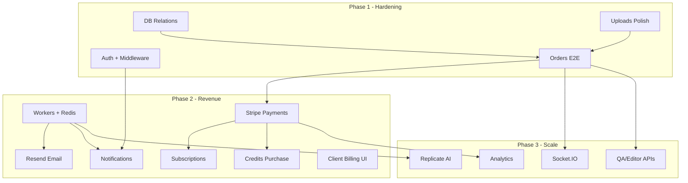

# Fotopixelz — Final Implementation Roadmap

**Version:** 1.0  
**Date:** June 6, 2026  
**Based on:** Full repository audit (`FOTOPIXELZ_PROJECT_STATUS_REPORT.md`)

---

## Vision

Fotopixelz is a B2B SaaS platform for professional image editing — connecting **clients** who submit orders with **editors** who produce deliverables and **QA reviewers** who approve quality before delivery.

**Current state:** The core **Client → Editor → QA → Delivered** pipeline is built and functional. Revenue collection, async infrastructure, AI automation, and marketing surfaces are not yet implemented.

**Target state:** Production SaaS with payments, subscriptions, automated notifications, optional AI pre-processing, and realtime order tracking.

---

## Architecture Reality Check

Before planning, align on what the codebase **actually uses** today:

```
┌─────────────┐     ┌─────────────┐     ┌──────────────────┐
│  apps/web   │     │ apps/admin  │     │  services/api    │
│  (Next 16)  │────▶│  (Next 16)  │────▶│  (Express 5)     │
│  Port 3000  │     │  Port 3001  │     │  Port 5000       │
└─────────────┘     └─────────────┘     └────────┬─────────┘
       │                    │                     │
       └────────────────────┴─────────────────────┤
                                                  ▼
                                    ┌─────────────────────────┐
                                    │  PostgreSQL + Prisma    │
                                    │  (22 models, 13 migr.)  │
                                    └─────────────────────────┘
                                                  │
                                    ┌─────────────────────────┐
                                    │  S3 / Cloudflare R2     │
                                    │  (presigned uploads)    │
                                    └─────────────────────────┘

NOT CONNECTED YET:
  apps/workers (BullMQ) ── Redis
  Socket.IO realtime
  Resend email ── Stripe payments ── Replicate AI
```

**Auth:** Custom JWT (`@repo/auth`) — not Clerk  
**Uploads:** S3/R2 presigned — not UploadThing  
**State:** React Context — not React Query / Zustand

---

## Module Implementation Matrix

### Legend
- ✅ Complete (MVP-ready)
- 🟡 Partial (usable with gaps)
- ⬜ Not started (placeholder only)

| # | Module | Status | % | Phase |
|---|--------|--------|---|-------|
| 1 | Authentication | 🟡 | 85% | 1 |
| 2 | Users | 🟡 | 80% | 1–2 |
| 3 | Organizations | 🟡 | 85% | 2 |
| 4 | Categories | ✅ | 95% | — |
| 5 | Addons | ✅ | 95% | — |
| 6 | Uploads | 🟡 | 90% | 1 |
| 7 | Orders | 🟡 | 90% | 1 |
| 8 | Assets | 🟡 | 85% | 1 |
| 9 | AI Processing | ⬜ | 5% | 3 |
| 10 | QA | 🟡 | 75% | 1–2 |
| 11 | Editors | 🟡 | 70% | 1–2 |
| 12 | Subscriptions | ⬜ | 10% | 2 |
| 13 | Payments | ⬜ | 5% | 2 |
| 14 | Credits | 🟡 | 60% | 2 |
| 15 | Notifications | ⬜ | 5% | 2 |
| 16 | Analytics | ⬜ | 5% | 3 |
| 17 | Admin | 🟡 | 85% | 1–2 |
| 18 | Realtime Events | ⬜ | 0% | 3 |
| 19 | Workers | ⬜ | 10% | 2 |

---

## Phase 1 — Critical: Production Hardening

**Timeline:** 1–2 weeks  
**Effort:** ~58 hours (~7–8 days)  
**Goal:** Ship the working MVP safely to production users

### 1.1 Infrastructure & Database
| Task | Owner | Hours | Done When |
|------|-------|-------|-----------|
| Deploy migrations to staging/production | DevOps | 2 | All 13 migrations applied |
| Verify S3/R2 credentials in all envs | DevOps | 2 | Upload + preview + download work |
| Add missing Prisma FK relations | Backend | 8 | Upload→Order, Order→Editor/QA relations |
| Seed staging with test users (all roles) | Backend | 4 | Editor, QA, client test accounts |

### 1.2 Security & Auth
| Task | Owner | Hours | Done When |
|------|-------|-------|-----------|
| Next.js middleware auth (web + admin) | Frontend | 8 | Unauthenticated users blocked server-side |
| Rotate JWT secrets for production | DevOps | 1 | Strong secrets in vault |
| Wire Resend for password reset emails | Backend | 8 | Reset link delivered via email |
| Remove unused Clerk env references or document | PM | 1 | No confusion in onboarding |

### 1.3 Workflow Polish
| Task | Owner | Hours | Done When |
|------|-------|-------|-----------|
| E2E test: V1 → revision → V2 → revision → V3 → deliver | QA | 8 | All versions + audit trail correct |
| Remove QA queue debug panel | Frontend | 1 | Clean QA inbox |
| Fix admin asset detail to use signed URLs | Frontend | 2 | No raw S3 URLs in UI |
| Wire order create upload picker (admin) | Frontend | 3 | selectedUploadIds in POST body |
| Verify thumbnail gallery on all roles | QA | 4 | Client, Editor, QA, Admin consistent |

### 1.4 Observability
| Task | Owner | Hours | Done When |
|------|-------|-------|-----------|
| Wire Sentry (DSN in .env.example) | Backend | 4 | API errors captured |
| Structured logging for order transitions | Backend | 4 | Traceable workflow in logs |
| Health check endpoint monitoring | DevOps | 2 | Uptime alerts configured |

### Phase 1 Exit Criteria
- [ ] Full order cycle works in staging without manual DB edits
- [ ] No raw storage URLs exposed in production UI paths
- [ ] Password reset works via email
- [ ] Auth enforced at middleware level
- [ ] All roles can log in and perform their workflow

---

## Phase 2 — Required: Revenue & Operations

**Timeline:** 4–6 weeks  
**Effort:** ~208 hours (~26 days)  
**Goal:** Collect payments, notify users, scale operations

### 2.1 Payments (Module 13)
| Task | Hours | Dependencies |
|------|-------|--------------|
| Stripe checkout session for order payment | 16 | Orders API |
| Stripe webhook handler (`payment-webhook.processor`) | 16 | Workers |
| `payments.service.ts` — create, confirm, refund | 16 | Prisma Payment model |
| Record `PAYMENT_CONFIRMED` workflow event | 4 | Workflow service |
| Client payment UI on order submit | 16 | Web order-upload-panel |
| Admin payment status on order detail | 8 | Admin order-detail |

### 2.2 Subscriptions & Credits (Modules 12, 14)
| Task | Hours | Dependencies |
|------|-------|--------------|
| Expand `OrganizationPlan` enum (STARTER, PRO, ENTERPRISE) | 4 | Migration |
| Stripe subscription products + prices | 16 | Stripe |
| Upgrade flow (replace disabled button) | 16 | Web demo banner |
| Credit purchase / top-up endpoint | 16 | Payments |
| Client billing page (invoices, payment history) | 24 | Payments API |
| Credit usage report (org dashboard) | 8 | Analytics-lite |

### 2.3 Notifications (Module 15)
| Task | Hours | Dependencies |
|------|-------|--------------|
| `notifications.service.ts` — CRUD | 12 | Prisma Notification |
| Email on: order submitted, assigned, ready for QA, delivered, revision | 16 | Resend + Workers |
| In-app notification bell (web + admin) | 16 | Notifications API |
| Mark read / unread count | 8 | Frontend |

### 2.4 Workers (Module 19)
| Task | Hours | Dependencies |
|------|-------|--------------|
| Redis connection in workers + API enqueue | 8 | REDIS_URL |
| Email processor (Resend) | 12 | Resend client |
| Notification processor | 8 | Notifications service |
| Delivery job (post-QA approve) | 8 | Orders service |
| Revision request job (notify editor) | 8 | Orders service |
| Editor assignment job (notify editor) | 8 | Admin service |
| Deploy workers as separate process | 8 | DevOps |

### 2.5 Client Portal Completion
| Task | Hours | Dependencies |
|------|-------|--------------|
| Settings page — profile edit, password change | 16 | Users API |
| Order list pagination + status filter | 12 | Orders API |
| ZIP bulk download (deliverables) | 16 | Workers zip.processor |
| Marketing: pricing page | 12 | Pricing API |
| Marketing: services landing pages (7) | 24 | Static content + catalog |

### 2.6 Admin Completion
| Task | Hours | Dependencies |
|------|-------|--------------|
| Payments section on order detail | 8 | Payments API |
| ZIP bulk download (source images) | 8 | Workers |
| Role-specific dashboard widgets | 16 | Analytics-lite |

### Phase 2 Exit Criteria
- [ ] Client can pay for orders via Stripe
- [ ] Org can upgrade from DEMO plan
- [ ] Email sent on every major status change
- [ ] Workers process jobs from Redis queue
- [ ] Client billing page shows invoices
- [ ] Marketing site has real pricing content

---

## Phase 3 — Enhancement: Scale & Differentiation

**Timeline:** 6–8 weeks  
**Effort:** ~304 hours (~38 days)  
**Goal:** AI automation, analytics, realtime, enterprise features

### 3.1 AI Processing (Module 9)
| Task | Hours | Dependencies |
|------|-------|--------------|
| `ai.service.ts` — create job, poll status, store output | 24 | Replicate SDK |
| Enqueue AI jobs from upload complete | 8 | Workers ai.processor |
| Admin AI job queue + status UI | 16 | AI API |
| Optional: auto background removal on upload | 16 | Assets + AI |
| Workflow events: AI_JOB_STARTED/COMPLETED (live) | 4 | Already labeled |

### 3.2 Dedicated QA & Editor APIs (Modules 10, 11)
| Task | Hours | Dependencies |
|------|-------|--------------|
| `qa.service.ts` — QAReview CRUD | 16 | QAReview model |
| `editing.service.ts` — EditingJob CRUD | 16 | EditingJob model |
| Editor workload dashboard | 16 | Editing API |
| QA side-by-side comparison UI | 24 | Upload gallery |
| `revisions.service.ts` — dedicated revision records | 12 | Revision model |

### 3.3 Analytics (Module 16)
| Task | Hours | Dependencies |
|------|-------|--------------|
| `analytics.service.ts` — order volume, revenue, turnaround | 24 | Orders + Payments |
| Analytics rollup worker (daily) | 12 | Workers |
| Admin analytics dashboard | 24 | Analytics API |
| Client usage dashboard (credits, orders) | 12 | Web dashboard |

### 3.4 Realtime Events (Module 18)
| Task | Hours | Dependencies |
|------|-------|--------------|
| Socket.IO server on API | 16 | Auth token on connect |
| Room per order / per user | 8 | Socket server |
| Emit on status change, upload complete, deliverable ready | 12 | Workflow service |
| Client + admin subscribe to order updates | 16 | socket.io-client |
| Replace manual refresh with live updates | 8 | Frontend |

### 3.5 Enterprise & Platform
| Task | Hours | Dependencies |
|------|-------|--------------|
| JWT refresh tokens | 16 | Auth package |
| Audit log API + admin viewer | 24 | AuditLog model |
| Team invite flow (web) | 24 | Organizations API |
| OpenAPI / Swagger documentation | 16 | All routes |
| Image optimization worker (sharp) | 24 | Workers |
| Remove dead root dependencies or wire them | 8 | package.json cleanup |

### Phase 3 Exit Criteria
- [ ] AI jobs processable end-to-end
- [ ] Realtime order status without page refresh
- [ ] Analytics dashboard for admin
- [ ] Dedicated QA/Editor job tracking
- [ ] API documented for integrations

---

## Module-by-Module Detail

### Module 1 — Authentication
```
Status:     🟡 85%
Completed:  Register, login, logout, me, forgot/reset password, JWT, bcrypt, 5 roles
Remains:    Resend email, refresh tokens, Next.js middleware, optional Clerk migration
Depends on: Resend (Phase 2)
Effort:     24h remaining
```

### Module 2 — Users
```
Status:     🟡 80%
Completed:  Profile GET/PATCH, billing profile, credits endpoint
Remains:    Web settings UI, password change, avatar
Depends on: Auth
Effort:     16h remaining
```

### Module 3 — Organizations
```
Status:     🟡 85%
Completed:  CRUD, memberships, demo workspace, credits
Remains:    Client org management, real plan tiers, team invites
Depends on: Payments, Subscriptions
Effort:     32h remaining
```

### Module 4 — Categories ✅
```
Status:     ✅ 95%
Completed:  Full API + admin + wizard integration + seed
Remains:    Minor polish only
Effort:     4h
```

### Module 5 — Addons ✅
```
Status:     ✅ 95%
Completed:  Full API + admin + wizard + OrderAddon pricing
Remains:    Minor polish only
Effort:     4h
```

### Module 6 — Uploads
```
Status:     🟡 90%
Completed:  Presigned S3/R2, complete, preview, delete, gallery UI
Remains:    ZIP batch, Prisma FK relations, upload-gallery edge cases
Depends on: Storage config
Effort:     16h remaining
```

### Module 7 — Orders
```
Status:     🟡 90%
Completed:  Full lifecycle, submit, assign, revision, status guards
Remains:    Pagination, cancel UI, admin create upload wiring
Depends on: Uploads, Pricing, Workflow
Effort:     24h remaining
```

### Module 8 — Assets
```
Status:     🟡 85%
Completed:  Deliverable upload, versioning, isCurrent, signed URLs
Remains:    FK relation cleanup, AssetVersion consolidation
Depends on: Uploads, Orders
Effort:     24h remaining
```

### Module 9 — AI Processing
```
Status:     ⬜ 5%
Completed:  AiJob schema, placeholder API + workers
Remains:    Replicate integration, job UI, enqueue from upload
Depends on: Workers, Assets
Effort:     80h
```

### Module 10 — QA
```
Status:     🟡 75%
Completed:  QA queue, review panel, revision request, approve→deliver
Remains:    QAReview table usage, comparison UI, dedicated API
Depends on: Orders, Assets
Effort:     32h remaining
```

### Module 11 — Editors
```
Status:     🟡 70%
Completed:  Assignment, production workspace, deliverable upload
Remains:    EditingJob queue, workload dashboard
Depends on: Orders, Assets
Effort:     32h remaining
```

### Module 12 — Subscriptions
```
Status:     ⬜ 10%
Completed:  DEMO plan enum, trial fields on org
Remains:    Stripe subscriptions, plan tiers, upgrade UI
Depends on: Payments
Effort:     40h
```

### Module 13 — Payments
```
Status:     ⬜ 5%
Completed:  Payment + Invoice schema
Remains:    Stripe checkout, webhooks, payment UI
Depends on: Orders
Effort:     40h
```

### Module 14 — Credits
```
Status:     🟡 60%
Completed:  Org credits, quote calculation, demo banner
Remains:    Purchase flow, usage reporting
Depends on: Payments
Effort:     24h remaining
```

### Module 15 — Notifications
```
Status:     ⬜ 5%
Completed:  Notification schema, placeholder API + workers
Remains:    Full API, email triggers, in-app UI
Depends on: Workers, Resend
Effort:     32h
```

### Module 16 — Analytics
```
Status:     ⬜ 5%
Completed:  Basic KPIs from list endpoints
Remains:    Analytics API, dashboards, rollup jobs
Depends on: Orders, Payments
Effort:     40h
```

### Module 17 — Admin
```
Status:     🟡 85%
Completed:  22 routes, full ops workflow, catalog, people, orgs
Remains:    Payments, AI, analytics screens, audit viewer
Depends on: All backend modules
Effort:     40h remaining
```

### Module 18 — Realtime Events
```
Status:     ⬜ 0%
Completed:  Placeholder socket.ts
Remains:    Socket.IO server, client subscriptions, event emitters
Depends on: Auth, Workflow
Effort:     40h
```

### Module 19 — Workers
```
Status:     ⬜ 10%
Completed:  6 jobs + 9 processors scaffolded, BullMQ deps
Remains:    Redis connection, enqueue from API, implement processors
Depends on: Redis, Resend, Stripe, Replicate
Effort:     48h
```

---

## Dependency Graph



---

## Effort Summary

| Phase | Focus | Hours | Calendar (1 dev) | Calendar (2 devs) |
|-------|-------|-------|------------------|-------------------|
| **Phase 1** | Production hardening | 58h | 7–8 days | 4–5 days |
| **Phase 2** | Revenue & operations | 208h | 26 days | 13–15 days |
| **Phase 3** | Scale & AI | 304h | 38 days | 19–22 days |
| **Total** | Full platform | **570h** | **~71 days** | **~36–42 days** |

*Assumes 7.5 productive hours/day, single full-stack developer. Parallel backend + frontend teams reduce calendar time.*

---

## Recommended Team Allocation

| Role | Phase 1 | Phase 2 | Phase 3 |
|------|---------|---------|---------|
| Backend engineer | DB, auth, Resend | Payments, workers, notifications | AI, analytics, realtime |
| Frontend engineer | Middleware, UI polish | Billing, marketing, notifications UI | Dashboards, comparison UI |
| DevOps | Migrations, S3, Sentry | Workers deploy, Redis | Socket.IO infra |
| QA | E2E workflow test | Payment flows | AI + realtime testing |

---

## Risk Register

| Risk | Impact | Mitigation |
|------|--------|------------|
| Unused root deps cause confusion | Medium | Document actual stack; prune or implement in Phase 3 |
| Orphan FK columns cause data integrity issues | High | Phase 1 migration for Upload/Order relations |
| Client-only auth bypass | High | Phase 1 Next.js middleware |
| No payment = no revenue | Critical | Phase 2 Stripe priority |
| 15m JWT TTL without refresh | Medium | Phase 3 refresh tokens or extend TTL interim |
| Dual versioning (Asset + AssetVersion) | Medium | Consolidate in Phase 1–2 refactor |
| Workers never enqueued | Medium | Phase 2 Redis + enqueue hooks |

---

## Success Metrics by Phase

### Phase 1
- Zero critical bugs in Editor → QA → Delivered flow
- 100% signed URLs in production UI (no raw S3)
- Password reset email delivery rate > 99%

### Phase 2
- Payment conversion on order submit > 80%
- Email notification within 60s of status change
- Worker job failure rate < 1%

### Phase 3
- AI job completion rate > 95%
- Realtime update latency < 2s
- Admin analytics load < 3s

---

## Immediate Next Actions (This Week)

1. **Run** `pnpm db:deploy` on staging
2. **Test** full revision workflow (V1→V2→V3) manually
3. **Remove** QA debug panel from `orders-page.tsx`
4. **Fix** `asset-detail-page.tsx` to use signed preview URL
5. **Wire** Resend for password reset (smallest email win)
6. **Add** Next.js middleware for `/dashboard/*` and `/admin/*`
7. **Prune** or document unused root `package.json` dependencies

---

## Document References

| Document | Purpose |
|----------|---------|
| `FOTOPIXELZ_PROJECT_STATUS_REPORT.md` | Full audit with tables and scores |
| `FOTOPIXELZ_FINAL_ROADMAP.md` | This implementation roadmap |
| `prisma/schema.prisma` | Source of truth for data model |
| `services/api/src/app.ts` | API route index |
| `.env.example` | Required environment variables |

---

*Roadmap version 1.0 — update after each phase completion.*
