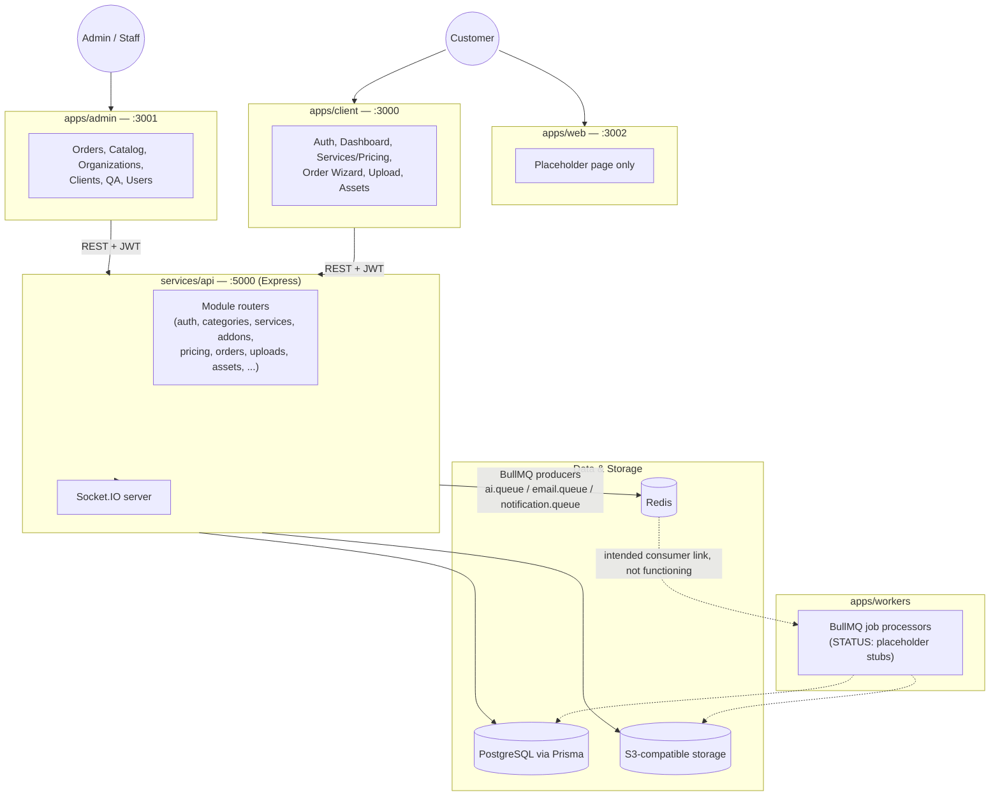

# Fotopixelz — Application & System Architecture

> Pass 1 documentation. Terminology (CURRENT/TARGET/GAP/STATUS) defined in `docs/README.md`. This document covers application boundaries, system architecture, repository structure, technology stack, and environment/runtime — not individual API endpoints or database fields (later passes).

---

## 1. Public Website — `apps/web`

**Port:** 3002 (`apps/web/package.json` → `"dev": "next dev -p 3002"`)

**Purpose (TARGET, stated in code comments/CLAUDE.md):** future public marketing site for `fotopixelz.com`, intentionally separate from the authenticated client app.

**CURRENT state — STATUS: STUB**
- Routes: only `/` (`apps/web/src/app/page.tsx`), plus root `layout.tsx`.
- Content: a single static `<main><p>Fotopixelz — public website coming soon.</p></main>`. No components, no data fetching, no styling beyond default.
- Components: none exist under this app beyond the root layout.
- Functionality: none. Not wired into Docker Compose or deployment (confirmed: `infrastructure/docker-compose.yml` defines `client`, `admin`, `worker`, `api`, `postgres`, `redis` services — no `web` service).

**Do not confuse with `apps/client`:** `apps/web` is the *future* public site placeholder. `apps/client` is the actual working authenticated application and is the historical `apps/web` (renamed as part of a workspace split — see `docs/architecture/architecture.md`).

**Target responsibility (TARGET, per CLAUDE.md):** homepage, services, pricing, about/company, contact — public marketing content, no auth, no dashboard. **Not yet built.**

---

## 2. Client Application — `apps/client`

**Port:** 3000 (`apps/client/package.json` → `"dev": "next dev -p 3000"`)

**Purpose:** authenticated customer/client application — the actual working product surface for end customers.

### Current routes (verified via `apps/client/src/app/**/page.tsx`)

| Route | Purpose | STATUS |
|---|---|---|
| `/` | Landing/redirect page to sign in / create account / dashboard | COMPLETE (simple, functional) |
| `/login`, `/register` | Credential + Google OAuth auth | COMPLETE |
| `/auth/callback` | OAuth callback handler | COMPLETE (not re-verified line-by-line this pass) |
| `/services` | Public service category grid, real API data | COMPLETE (implemented in this engagement; previously STUB) |
| `/services/[7 fixed slugs]` (`ai-backgrounds`, `background-removal`, `clipping-path`, `color-correction`, `ghost-mannequin`, `retouching`, `shadow-creation`) | Service detail pages, one shared template | COMPLETE for routes whose slug matches seeded category data; PARTIAL/empty-state for unseeded categories (real behavior, not a bug — no fabricated data shown) |
| `/pricing` | Per-service pricing table + addons + FAQ, real API data | COMPLETE (implemented in this engagement; previously STUB) |
| `/dashboard` | Overview: demo-account banner, quick links to orders/assets | COMPLETE |
| `/dashboard/orders` | Order list | COMPLETE (not re-verified line-by-line this pass) |
| `/dashboard/orders/new` | Order creation wizard (category → services → addons → quote → place order), supports `?categoryId=` deep link | COMPLETE |
| `/dashboard/orders/[orderId]` | Order detail: status timeline, upload panel, comments, deliverables | COMPLETE |
| `/dashboard/assets` | Downloadable deliverables grouped by order | COMPLETE |
| `/dashboard/billing` | — | STUB (placeholder page, no API calls) |
| `/dashboard/settings` | — | STUB (placeholder page, no API calls) |

### Major areas
- **Authentication:** `apps/client/src/components/auth-pages.tsx`, `auth-provider.tsx` — JWT bearer token stored client-side, Google OAuth via `startGoogleOAuth`, email verification enforced server-side at login.
- **Dashboard shell:** `ClientShell` (`apps/client/src/components/client-shell.tsx`) enforces auth + client-role + allowed-path checks client-side, redirects unauthenticated users to `/login?next=...`.
- **Organization:** `OrganizationProvider` (`apps/client/src/components/organization-provider.tsx`) — workspace/org context wrapping the dashboard.
- **Services/Pricing:** new `apps/client/src/lib/service-catalog.ts` + `apps/client/src/components/marketing/*` — consumes public `GET /categories`, `GET /services`, `GET /addons`.
- **Orders:** `apps/client/src/components/order-wizard/*` — order creation; `order-status-timeline.tsx`, `client-order-comments.tsx`, `order-deliverables.tsx` — order detail.
- **Uploads:** `apps/client/src/components/order-upload/order-upload-panel.tsx` + shared `packages/upload-gallery` — real progress/retry/remove via XHR, not simulated.
- **Billing/Settings:** not implemented beyond placeholder routes.

---

## 3. Admin Application — `apps/admin`

**Port:** 3001 (`apps/admin/package.json` → `"dev": "next dev -p 3001"`)

**Purpose:** internal operations application for staff (`ADMIN`, `SUPER_ADMIN`, `EDITOR`, `QA` roles).

### Current routes (verified via `apps/admin/src/app/**/page.tsx`)

| Route | Purpose |
|---|---|
| `/login`, `/forgot-password`, `/reset-password` | Staff auth |
| `/admin` | Dashboard overview |
| `/admin/orders`, `/admin/orders/[orderId]` | Order queue + order detail/production workspace |
| `/admin/clients` | Client/customer management |
| `/admin/organizations` | Organization management |
| `/admin/services`, `/admin/categories`, `/admin/addons` | Catalog/pricing management |
| `/admin/editors` | Editor staff management |
| `/admin/users` | User management |
| `/admin/qa` | QA review queue |
| `/admin/assets`, `/admin/assets/[assetId]` | Asset management |
| `/admin/uploads` | Upload management |
| `/admin/profile`, `/admin/settings` | Account/app settings |

**Dashboard, customers, orders, services, pricing:** implemented with real API-backed CRUD (`apps/admin/src/components/{orders-page,catalog-page,organizations-page,people-page,...}.tsx`), using `useApiList`/`apiRequest` data hooks — not mock data.

**Admins/roles/permissions:** role gating implemented via `isManagementRole`/`normalizeRole` (`apps/admin/src/lib/access-control.ts`, not re-read line-by-line this pass) and server-side `requireAdmin`/`requireAuth` middleware in `services/api/src/common/middleware/`. A dedicated roles-management UI was not separately confirmed in this pass — `/admin/users` and `/admin/editors` appear to be the relevant surfaces.

**Design system note:** `apps/admin` does **not** share `apps/client`'s shadcn/Tailwind component system — it has its own hand-rolled kit (`apps/admin/src/components/ui.tsx`: `Button`, `Card`, `DataTable`, `Modal`, etc.) with its own CSS custom properties and `Arial, Helvetica, sans-serif` font stack (`apps/admin/src/app/globals.css`), independent of `apps/client`'s Geist/oklch token system.

---

## 4. API — `services/api`

**Port:** 5000 (`services/api/src/config/env.ts` → `port: Number(process.env.PORT ?? 5000)`)

**Framework:** Express 5, TypeScript, `tsx watch` for dev (`"dev": "tsx watch src/bootstrap.ts"`).

**Entry point:** `services/api/src/bootstrap.ts` (loads env) → `services/api/src/server.ts`.

**Modules** (module-per-domain under `services/api/src/modules/`, verified present):
`addons`, `admin`, `ai`, `analytics`, `assets`, `audit-logs`, `auth`, `categories`, `editing`, `editors`, `notifications`, `order-comments`, `orders`, `organizations`, `payments`, `pricing`, `qa`, `revisions`, `services`, `subscriptions`, `uploads`, `users`, `workflow`.

Each typically has `*.controller.ts`, `*.service.ts`, `*.routes.ts`, `*.types.ts`, `*.validator.ts`. Full endpoint-by-endpoint documentation is deferred to a later pass; this pass verified only the `categories`, `services`, `addons`, and `pricing` routers directly (used by the new Services/Pricing pages):
- `GET /categories`, `GET /categories/:id` — public; write ops require `requireAuth` + `requireAdmin`.
- `GET /services`, `GET /services/:id` — public, server-side filters out inactive services by default; write ops require auth+admin.
- `GET /addons`, `GET /addons/:id` — public; write ops require auth+admin.
- `POST /pricing/quote` — requires `requireAuth` (needs an authenticated organization context).

**Database access:** via `@repo/database` (`packages/database`), which wraps `@prisma/client` using `@prisma/adapter-pg`. Modules import the Prisma client through this package rather than importing `@prisma/client` directly (per CLAUDE.md convention).

**Authentication:** JWT bearer token issued by `auth` module; `common/middleware/auth.ts` (`requireAuth`) and `common/middleware/admin.ts` (`requireAdmin`) gate routes. Google OAuth handled via `google-oauth.service.ts` + `oauth-state.ts`. Email verification enforced at login via `email-verification.service.ts`.

**External integrations** (`services/api/src/integrations/`):
- `cloudinary/client.ts`
- `redis/client.ts`
- `storage/` (S3-compatible provider, config, key helpers)
- `stripe/client.ts`

**Cross-cutting:**
- `common/errors/` — `AppError` and typed error classes.
- `common/middleware/error-handler.ts` — formats thrown `AppError`s into responses.
- `queues/` — BullMQ **producers** only: `ai.queue.ts`, `email.queue.ts`, `notification.queue.ts`. Actual job **consumers** live in `apps/workers`.
- `sockets/socket.ts` — Socket.IO server setup (present; not re-verified for functionality this pass).

**Current state:** the modules exercised directly in this engagement (`auth`, `categories`, `services`, `addons`, `pricing`, `orders`, `uploads`, `assets`) are real, connected implementations — not scaffolding. Other modules (`ai`, `analytics`, `subscriptions`, `workflow`, `audit-logs`) were not independently re-verified in this pass; treat their maturity as **not established** until a later documentation pass inspects them directly.

---

## 5. High-Level System Architecture

**CURRENT**, based on directly inspected code (not the older, now-superseded diagram in `docs/reports/FOTOPIXELZ_CURRENT_PROJECT_STATUS.md`, which predates the `apps/web`/`apps/client` split):



**Notes on the diagram:**
- The `API → Redis → Workers` path represents queue **producers** that exist in `services/api/src/queues/`; the **consumer** side in `apps/workers` is present as files but contains placeholder logic only (`status: 'placeholder'`), so this path is drawn as not-currently-functioning (dashed).
- `apps/web` has no live connection to the API — it renders static placeholder content only.
- Both `apps/client` and `apps/admin` talk to the same single API; there is no separate admin-only backend.

---

## 6. Repository Structure

**CURRENT**, top-level layout (verified via direct directory listing):

| Directory | Purpose |
|---|---|
| `apps/web` | Public marketing site — placeholder scaffold (port 3002) |
| `apps/client` | Authenticated client application (port 3000) |
| `apps/admin` | Authenticated admin/operations application (port 3001) |
| `apps/workers` | Standalone process for BullMQ job processors — currently placeholder logic |
| `services/api` | Express REST API and workflow orchestration (port 5000) |
| `packages/auth` | Shared JWT/auth helpers |
| `packages/database` | Prisma client wrapper (via `@prisma/adapter-pg`) — canonical DB access point |
| `packages/email` | Resend + React Email templates |
| `packages/types` | Shared TypeScript types |
| `packages/ui` | Shared UI component package — design tokens (`tokens.css`) and initial primitives (`Button`, `Card`, `Badge`, `Alert`, per `docs/DESIGN-SYSTEM.md`) now exist. **Consumed by `apps/admin`** (`Button`/`StatusBadge`/`RoleBadge`/`ErrorBanner`/`SuccessBanner` wired, verified in-browser) — `Card` and everything without a shared equivalent (`DataTable`, `Modal`, form fields) still uses admin's own CSS. **Not yet consumed by `apps/client`.** |
| `packages/upload-gallery` | Shared upload/preview gallery UI, consumed by `apps/client` and `apps/admin` |
| `packages/utils` | Shared utility functions |
| `packages/validators` | Shared validation schemas |
| `packages/config` | Shared configuration |
| `prisma/` | Canonical Prisma schema (`schema.prisma`, 23 models), migrations, and `seed.ts` |
| `infrastructure/` | Docker Compose + per-app Dockerfiles (`api`, `client`, `admin`, `worker`) |
| `docs/` | Engineering documentation (this file's home) — see `docs/README.md` for the folder taxonomy |

---

## 7. Technology Stack

**CURRENT**, verified from `package.json` files and direct code inspection:

| Layer | Technology |
|---|---|
| Frontend framework | Next.js 16 (React 19), three separate apps |
| Frontend styling (client app) | Tailwind CSS + shadcn-style component primitives, oklch design tokens |
| Frontend styling (admin app) | Custom hand-rolled CSS component kit (separate from client's system) |
| Backend framework | Express 5 (TypeScript) |
| Database | PostgreSQL |
| ORM | Prisma (v7-generation client), accessed via `@prisma/adapter-pg` through `packages/database` |
| Object storage | S3-compatible storage (`services/api/src/integrations/storage/`); Cloudinary client also present |
| Queue | BullMQ (producers implemented in `services/api/src/queues/`; consumers in `apps/workers` are placeholders) |
| Cache/broker | Redis (`services/api/src/integrations/redis/client.ts`; also the BullMQ backing store) |
| Realtime | Socket.IO (`services/api/src/sockets/socket.ts`) |
| Authentication | Custom JWT (bearer token), issued/verified in `packages/auth` + `services/api/src/modules/auth` |
| OAuth | Google OAuth 2.0 (`google-oauth.service.ts`) |
| Email | Resend (`RESEND_API_KEY`), React Email templates in `packages/email` |
| Payments | Stripe client present (`services/api/src/integrations/stripe/client.ts`); end-to-end payment flow not re-verified this pass |
| Build system | Turborepo |
| Package manager | pnpm (v11.4.0) |
| Deployment tooling | Docker Compose + per-service Dockerfiles under `infrastructure/docker/` |

---

## 8. Environment / Runtime

### Local development ports
| Port | App |
|---|---|
| 3000 | `apps/client` |
| 3001 | `apps/admin` |
| 3002 | `apps/web` |
| 5000 | `services/api` |

### Development commands (root `package.json`)
```
pnpm dev              # all apps/services in parallel
pnpm dev:client       # apps/client only
pnpm dev:admin        # apps/admin only
pnpm dev:api          # services/api only
pnpm dev:workers      # apps/workers only
pnpm --filter web run dev   # apps/web only (no root alias)

pnpm build / lint / typecheck   # turbo run <script> across all packages
pnpm db:generate / db:migrate / db:deploy / db:studio / db:seed
```

### Major environment variables (names only — see `services/api/src/config/env.ts`; no values reproduced here)
`NODE_ENV`, `PORT`, `DATABASE_URL`, `JWT_ACCESS_SECRET`, `JWT_ACCESS_TTL`, `OAUTH_STATE_SECRET`, `WEB_APP_URL`, `ADMIN_APP_URL`, `API_BASE_URL`, `APP_NAME`, `SUPPORT_EMAIL`, `GOOGLE_CLIENT_ID`, `GOOGLE_CLIENT_SECRET`, `GOOGLE_REDIRECT_URI`, `REDIS_URL`, `STRIPE_SECRET_KEY`, `CLOUDINARY_CLOUD_NAME`, `RESEND_API_KEY`, `EMAIL_FROM`, `EMAIL_REPLY_TO`, `EMAIL_LOGO_URL`, `ENFORCE_EMAIL_VERIFICATION`, `STORAGE_PROVIDER`, `STORAGE_UPLOAD_EXPIRY_SECONDS`, `STORAGE_DOWNLOAD_EXPIRY_SECONDS`, `ADMIN_NOTIFICATION_EMAIL`.

Client app: `NEXT_PUBLIC_API_BASE_URL` (`apps/client/src/lib/api-client.ts`).

For a full documented reference with descriptions, see the existing living document `docs/architecture/env.md` (not duplicated here — that document remains the authoritative env reference per `docs/README.md`).

### External service dependencies
PostgreSQL, Redis, an S3-compatible object store, Cloudinary, Resend (email), Stripe, Google OAuth.

---

## 9. Current vs Target Architecture

| Area | CURRENT | TARGET | GAP |
|---|---|---|---|
| Public Website | Single placeholder page, no routes beyond `/`, not in Docker Compose | Full marketing site (home, services, pricing, about, contact) per CLAUDE.md | Entire site content and Docker/deploy wiring |
| Client | Auth, dashboard, services/pricing (new), order wizard, uploads, assets — all real and API-connected. Billing/settings are stubs | Full client workspace including billing and settings | Billing and settings implementation |
| Admin | Real CRUD across orders, catalog, organizations, clients, QA, users, assets, uploads | Not established as a distinct target beyond current scope | Design-system alignment with client app (separate component kits today) |
| API | Auth, categories, services, addons, pricing, orders, uploads, assets modules verified real in this pass; other modules present but not re-verified | Not established beyond "module-per-domain" structure already in place | Endpoint-level documentation/verification for `ai`, `analytics`, `subscriptions`, `workflow`, `audit-logs`, `payments` (deferred to later pass) |
| Database | 23 Prisma models covering identity, catalog, operations, workflow, commerce, platform domains | Not established as changing in this pass | None identified in this pass (schema not modified) |
| Storage | S3-compatible provider integration present and used by uploads/assets | Not established beyond current | None identified in this pass |
| Workers | Queue names registered (`apps/workers/src/queues/registry.ts`); every processor is a placeholder stub | Working BullMQ consumers per `docs/architecture/architecture.md` "Next Implementation Phases" (queue broker wiring, retries, dead-letter strategy) | Full job-processing implementation — currently 0% functional despite scaffolding existing |
| Redis | Client configured (`services/api/src/integrations/redis/client.ts`), used as BullMQ backing store for producers | Fully wired producer→consumer pipeline | Consumer side non-functional (see Workers row) |

---

*Next documentation pass: module-level and API-endpoint-level documentation (per `docs/README.md` reading order), not started in this pass.*
