# Orders

## Purpose
The central entity of the product: a client's request for editing work, tracked from creation through delivery. This is the most fully implemented module in the codebase.

## Users / Roles
`CLIENT` (creates/uploads/submits), `EDITOR` (assigned production work), `QA` (assigned review), `ADMIN`/`SUPER_ADMIN` (full control, assignment, manual overrides).

## Current Implementation
Real, production-grade implementation — verified directly by reading `orders.service.ts` in full. Handles creation, quoting, upload-gated submission, role-scoped status transitions, editor/QA assignment, revision requests, workflow-event logging, and transactional email side-effects.

## Frontend
- `apps/client/src/components/order-wizard/order-wizard.tsx` — creation (category → services → addons → quote → place order), supports `?categoryId=` deep link.
- `apps/client/src/app/dashboard/orders/page.tsx`, `apps/client/src/app/dashboard/orders/[orderId]/page.tsx` — list + detail (status timeline, upload panel, comments, deliverables).
- `apps/admin/src/components/orders-page.tsx`, `order-detail-page.tsx`, `order-production-workspace.tsx`, `order-timeline-panel.tsx` — admin queue, detail, and production workspace.

## Backend
`services/api/src/modules/orders/`: `orders.controller.ts`, `orders.routes.ts`, `orders.service.ts`, `order-status-transitions.ts`, `order-billing.ts`, `order-number.ts`, `order-notification-emails.ts`.

## Database
`Order` (orderNumber unique, organizationId, createdById, categoryId, assignedEditorId, assignedQaId, status, priority, totalImages, creditsUsed, totalAmount, currency, dueDate, reviewRound, deliverableVersion, isDeleted soft-delete), `OrderItem`, `OrderAddon`, plus related `Asset`, `Revision` (model exists but unused — see Business Rules), `Payment`, `Invoice`, `WorkflowEvent`, `OrderComment`.

## APIs
`GET /orders/health`, `POST /orders`, `GET /orders`, `PATCH /orders/status`, `PATCH /orders/assign-editor`, `PATCH /orders/assign-qa`, `POST /orders/request-revision`, `POST /orders/:id/submit`, `GET /orders/:id`, `PATCH /orders/:id`, `DELETE /orders/:id`. All require `requireAuth`; role-scoping is enforced inside the service layer, not via separate routers.

## Business Rules
- Orders are created with status `SUBMITTED` (not `DRAFT` — despite `DRAFT` existing in the enum and appearing in client-side pre-upload logic, `createOrder` always sets `status: 'SUBMITTED'` directly).
- Order numbers are generated via `generateOrderNumber()` (`order-number.ts`), guaranteed unique (`@unique` on `orderNumber`).
- Pricing lines (`items`/`addons`) can only be modified while the order is in a pre-upload status (`isPreUploadOrderStatus`) — `AppError(400, ...)` otherwise.
- **Editor assignment** requires the order to be in `PENDING` status and the target user to actually have `role: 'EDITOR'`.
- **QA assignment** is allowed across a wider range of statuses (`PENDING`, `ASSIGNED`, `IN_PROGRESS`, `READY_FOR_QA`, `REVISION_REQUIRED`) but not after `DELIVERED`.
- An editor **cannot** move an order to `READY_FOR_QA` unless: a QA reviewer is already assigned, at least one current deliverable exists for the current review round, and the deliverable count matches the source upload count (`assertSourceDeliverableCountMatch`).
- An order **cannot** be marked `DELIVERED` unless it passed QA (`READY_FOR_QA` immediately prior, unless admin override) and has at least one current ready/delivered deliverable.
- A `REVISION_REQUIRED` transition from `READY_FOR_QA` requires `revisionTitle` + `revisionComment` when initiated by QA via the generic status-update endpoint, and bumps `reviewRound`. There is also a **dedicated** `POST /orders/request-revision` endpoint restricted to the order's assigned QA reviewer.
- **The dedicated `Revision` Prisma model is not written to by this workflow** — revision requests are represented purely via `Order.status = REVISION_REQUIRED` + `Order.reviewRound` + a `WorkflowEvent` + an `OrderComment` (type `REVISION`). This is a notable model/behavior mismatch (see Gap).
- All state changes are recorded as `WorkflowEvent` rows (`recordWorkflowEvent`/`recordOrderStatusChange`), and several transitions also trigger transactional emails (`order-notification-emails.ts`) and system-authored `OrderComment`s.
- Soft-delete only (`isDeleted: true`); admin-only.

## Workflow — Order State Machine

Verified directly from `orders.service.ts` (`assertAllowedStatusTransition`, `CLIENT_STATUS_UPDATES`, `EDITOR_STATUS_UPDATES`, `QA_STATUS_UPDATES`, and the explicit business-rule guards). **This diagram includes only transitions actually enforced in code — no invented transitions.**

```mermaid
stateDiagram-v2
    [*] --> SUBMITTED: createOrder (CLIENT/ADMIN)
    SUBMITTED --> UPLOADED: client uploads + client-side "Continue" (markOrderUploaded, via PATCH /orders/status)
    UPLOADED --> PENDING: POST /orders/:id/submit (CLIENT only; requires ≥1 uploaded file)
    PENDING --> ASSIGNED: PATCH /orders/assign-editor (ADMIN only)
    ASSIGNED --> IN_PROGRESS: EDITOR (assigned editor only)
    IN_PROGRESS --> READY_FOR_QA: EDITOR (requires QA assigned + deliverables uploaded + count match)
    READY_FOR_QA --> DELIVERED: QA (assigned QA only) or ADMIN (requires deliverables)
    READY_FOR_QA --> REVISION_REQUIRED: QA (assigned QA only, via status update or POST /orders/request-revision; requires title+comment); reviewRound += 1
    REVISION_REQUIRED --> IN_PROGRESS: EDITOR (assigned editor only)
    REVISION_REQUIRED --> READY_FOR_QA: EDITOR (same deliverable-readiness checks as above)
    DELIVERED --> [*]
    SUBMITTED --> CANCELLED: CLIENT (self-service cancel, per CLIENT_STATUS_UPDATES)
    DRAFT --> SUBMITTED: allowed in CLIENT_STATUS_UPDATES list, but no observed code path sets DRAFT
    note right of DRAFT
        DRAFT exists in the OrderStatus enum
        and in CLIENT_STATUS_UPDATES, but
        createOrder() always starts at SUBMITTED.
        No confirmed path creates a DRAFT order.
    end note
    note right of ASSIGNED
        ADMIN can set any CLIENT_STATUS_UPDATES /
        EDITOR_STATUS_UPDATES / QA_STATUS_UPDATES
        status directly (isAdmin bypasses
        assertAllowedStatusTransition).
    end note
```

### Status reference table

| Status | Meaning | Who can set it | Who can see the order in it |
|---|---|---|---|
| `DRAFT` | In enum + client status-update allowlist; no confirmed creation path in current code | N/A (unused in practice) | N/A |
| `SUBMITTED` | Order created, awaiting image upload | System (on creation), or CLIENT/ADMIN via status update | Owning client, admins |
| `UPLOADED` | Client has attached source images, not yet formally submitted for production | CLIENT (via status update, e.g. client "Continue" step) | Owning client, admins |
| `PENDING` | Formally submitted, awaiting editor assignment; billing finalized here | CLIENT via `POST /orders/:id/submit` | Owning client, admins |
| `ASSIGNED` | An editor has been assigned | ADMIN only (`assign-editor`) | Owning client, admins, assigned editor |
| `IN_PROGRESS` | Editor actively working | Assigned EDITOR | Owning client, admins, assigned editor/QA |
| `READY_FOR_QA` | Editor submitted deliverables for review | Assigned EDITOR (with readiness checks) | Admins, assigned editor/QA; client sees status label |
| `REVISION_REQUIRED` | QA rejected, sent back with notes | Assigned QA (with required title/comment) | Admins, assigned editor/QA; client sees status label |
| `DELIVERED` | QA-approved, deliverables finalized and visible to client | Assigned QA, or ADMIN | Owning client (download access), admins |
| `CANCELLED` | Client-cancelled | CLIENT (per allowlist) | Owning client, admins |

## Permissions
- **CLIENT:** create orders, update pre-upload orders they own (org membership required), set `DRAFT`/`SUBMITTED`/`UPLOADED`/`PENDING`/`CANCELLED` (via `POST /orders/:id/submit` for the `PENDING` transition specifically), view/list only their organization's orders.
- **EDITOR:** view/act only on orders where `assignedEditorId === self`; can move `ASSIGNED→IN_PROGRESS`, `IN_PROGRESS→READY_FOR_QA`, `REVISION_REQUIRED→{IN_PROGRESS, READY_FOR_QA}`.
- **QA:** view/act only on orders where `assignedQaId === self`; can move `READY_FOR_QA→{DELIVERED, REVISION_REQUIRED}`; only QA can call `POST /orders/request-revision`.
- **ADMIN/SUPER_ADMIN:** full access — view all orders, override any status transition (bypasses the editor/QA transition guard), assign editors/QA, delete (soft) orders, override totals.

## Validation
Zod validators in `orders.validator.ts` (not individually enumerated this pass); extensive runtime business-rule validation is enforced directly in `orders.service.ts` (see Business Rules above) beyond schema-level validation.

## Error Handling
Consistent `AppError` usage with specific, user-facing messages (e.g. "A QA reviewer must be assigned before sending this order to QA", "Upload at least one deliverable before submitting to QA", "Order must pass QA review before it can be delivered").

## Dependencies
`pricing` (quote at creation/update), `assets` (deliverable-readiness checks), `organizations` (membership/credit access), `workflow` (event logging), `order-comments` (system + revision comments), `notifications`/email (`order-notification-emails.ts`).

## Current Status
**COMPLETE** for the core lifecycle (creation → upload → submission → assignment → production → QA → delivery). This is the most thoroughly implemented business-logic module found in this pass.

## Known Limitations
- `DRAFT` status is defined but has no confirmed code path that creates an order in that state — dead enum value in practice.
- The dedicated `Revision` Prisma model is not populated by the actual revision workflow (see Gap).
- Order cancellation (`CANCELLED`) exists in the client allowlist but the triggering UI/flow was not confirmed in this pass.

## Target
Not established in current codebase beyond what's implemented — the state machine above appears to be the intended, fully-built design, not a partial scaffold.

## Gap
- **`Revision` model vs. actual behavior:** the schema models revisions as a first-class entity (`Revision` table with `status: REQUESTED/IN_PROGRESS/RESOLVED/REJECTED`), but the real implementation represents revisions entirely through `Order.status`/`reviewRound` + `WorkflowEvent` + `OrderComment`. Either the `Revision` model is legacy/unused, or a `revisions` module was intended to layer on top and was never wired in (consistent with `docs/13-REVISIONS.md` showing that module as a placeholder).
- `DRAFT` status cleanup (remove from enum/allowlist, or implement an actual draft-saving path) is an open item, not a stated requirement.
