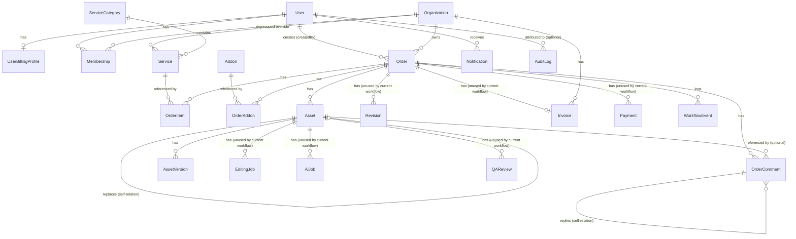

# Database

Source: `prisma/schema.prisma` (single canonical schema, PostgreSQL, Prisma client accessed via `@repo/database`/`@prisma/adapter-pg` per CLAUDE.md convention). 23 models, 18 migrations in `prisma/migrations/` (latest confirmed: `20260707000000_backfill_email_verified_existing_users`). No schema changes were made in this documentation pass.

## Enums
`UserRole`, `MembershipRole`, `OrganizationPlan` (`DEMO` only), `SubscriptionStatus`, `OrderStatus`, `AssetStatus`, `StorageProvider` (`AWS_S3`/`CLOUDFLARE_R2`), `UploadStatus`, `OrderPriority`, `EditingJobStatus`, `AiJobStatus`, `QAStatus`, `RevisionStatus`, `PaymentStatus`, `NotificationType`, `WorkflowEventType`, `AddonPricingType`, `CommentType`, `CommentStatus`.

## Entity-Relationship Diagram

## Model reference

### `User`
**Purpose:** Every human account — client, editor, QA, admin, super admin — single table for all roles.
**Key fields:** `email` (unique), `password` (nullable — OAuth-only users have none), `googleId` (unique, nullable), `role` (`UserRole`, default `CLIENT`), `isActive`, `emailVerifiedAt` + verification token/expiry, `passwordResetToken` + expiry.
**Relationships:** 1:1 `UserBillingProfile`; 1:N `Membership`, `Order` (as creator), `EditingJob` (as editor — unused path), `QAReview` (as reviewer — unused path), `Revision` (as requester — unused path), `Asset` (as uploader), `Notification`, `AuditLog`, `WorkflowEvent` (as actor), `OrderComment` (as author and as resolver).
**Consumers:** `auth`, `users`, `admin`, `orders` (createdBy/assignedEditorId/assignedQaId — the latter two are plain string FKs, not Prisma relations, per schema).
**Current usage:** Heavily used, core identity table — COMPLETE.

### `UserBillingProfile`
**Purpose:** Per-user billing/company details (name, address, tax id), separate from org-level invoicing.
**Consumers:** `users` module (`getMyBilling`/`updateMyBilling`) — real backend, no confirmed frontend consumer (see `docs/04-USERS.md`).
**Current usage:** PARTIAL.

### `Organization`
**Purpose:** Client workspace/tenant. Owns orders, org-scoped services, invoices, and free-image-credit balance.
**Key fields:** `slug` (unique), `plan` (`DEMO` only value currently defined), `subscriptionStatus`, `trialEndsAt`, `freeImageCredits`, `usedImageCredits`.
**Relationships:** 1:N `Membership`, `Order`, `Service` (org-scoped overrides), `Invoice`.
**Consumers:** `organizations`, `auth` (bootstrap on registration), `orders` (credit consumption at submission), `pricing` (org-scoped service resolution).
**Current usage:** COMPLETE — actively read/written across the core workflow.

### `Membership`
**Purpose:** Join table between `User` and `Organization`, with an org-scoped role (`MembershipRole`, distinct enum from `UserRole`).
**Unique constraint:** `[userId, organizationId]`.
**Consumers:** `organizations` (CRUD), `orders` (`ensureOrganizationAccess` membership lookup for non-admin access control).
**Current usage:** COMPLETE for its access-control role; the distinct-role dimension (`MembershipRole` vs `UserRole`) is defined but its practical difference from the global role was not fully reconciled in this pass (see `docs/05-ORGANIZATIONS.md`).

### `ServiceCategory`
**Purpose:** Top-level catalog grouping (e.g. "Background Removal").
**Key fields:** `slug` (unique).
**Consumers:** `categories`, `services` (FK), order wizard, public `/services`/`/pricing` pages.
**Current usage:** COMPLETE.

### `Service`
**Purpose:** An individually priced editing service within a category. May be global (`organizationId: null`) or org-specific.
**Key fields:** `slug` (unique), `basePrice`, `isActive`.
**Indexes:** `[categoryId]`.
**Consumers:** `services`, `pricing` (`resolveServiceLines`), `orders` (`OrderItem.serviceId`).
**Current usage:** COMPLETE.

### `Addon`
**Purpose:** Optional priced add-on (fixed or per-image).
**Key fields:** `slug` (unique), `pricingType` (`FIXED`/`PER_IMAGE`), `credits`, `isActive`.
**Index:** `[isActive]`.
**Consumers:** `addons`, `pricing` (`resolveAddonLines`), `orders` (`OrderAddon.addonId`).
**Current usage:** COMPLETE.

### `Order`
**Purpose:** The central workflow entity — see `docs/08-ORDERS.md` for the full state machine.
**Key fields:** `orderNumber` (unique), `status` (`OrderStatus`), `priority`, `totalImages`, `creditsUsed`, `totalAmount`, `currency`, `reviewRound`, `deliverableVersion` (defined but not confirmed as actively incremented in traced code — flagged, not asserted), `isDeleted` (soft delete).
**Foreign keys:** `organizationId` → `Organization` (relation); `createdById` → `User` (relation, "OrderCreatedBy"); `categoryId` (plain string, no enforced relation in schema — informational link to `ServiceCategory`); `assignedEditorId`, `assignedQaId` (plain strings, **not** Prisma relations — resolved manually in service code via separate `prisma.user.findFirst` lookups).
**Indexes:** `[organizationId, status]`, `[orderNumber]`, `[createdById]`, `[assignedEditorId, status]`, `[assignedQaId, status]`, `[categoryId]`, `[isDeleted]`.
**Consumers:** `orders` (primary), `assets` (integrity checks), `pricing` (quote), `workflow` (event log), `order-comments`.
**Current usage:** COMPLETE — the most heavily used and correctly indexed model in the schema.

### `OrderItem` / `OrderAddon`
**Purpose:** Line items for services/addons on an order, snapshotting `unitPrice`/`subtotal` at order-time (not live-recalculated from catalog after creation, except when explicitly updated pre-upload).
**Indexes:** `[orderId]`, `[serviceId]` / `[orderId]`, `[addonId]`.
**Current usage:** COMPLETE.

### `Asset`
**Purpose:** A deliverable (edited) file against an order — see `docs/10-ASSETS.md`.
**Key fields:** `status` (`AssetStatus`), `version`, `reviewRound`, `isCurrent`, `qaNotes` (JSON), `replacesAssetId` (self-relation), `isDeleted`.
**Indexes:** `[organizationId, status]`, `[orderId, status]`, `[orderId, version]`, `[orderId, reviewRound]`, `[orderId, isCurrent]`, `[uploadId]`, `[createdById]`, `[uploadedById]`, `[isDeleted]` — well-indexed for the actual query patterns used (per-order, per-round, current-only filtering).
**Consumers:** `assets` (primary), `orders` (delivery/integrity checks).
**Current usage:** COMPLETE.

### `AssetVersion`
**Purpose:** A secondary, explicit version-history table per asset (unique on `[assetId, versionNumber]`).
**Current usage:** COMPLETE (API-wired) but **overlaps conceptually with `Asset.replacesAssetId`** — two mechanisms for representing "a new version of this file" exist on the schema without a single documented source of truth (see `docs/10-ASSETS.md` Known Limitations).

### `Upload`
**Purpose:** A client-submitted source file — see `docs/09-UPLOADS.md`.
**Key fields:** `status` (`UploadStatus`), `orderId` (nullable — an upload can exist before being attached to an order, though the confirmed client flow always ties it to one).
**Indexes:** `[organizationId, status]`, `[userId]`, `[orderId]`, `[storageProvider]`.
**Current usage:** COMPLETE.

### `EditingJob`, `AiJob`, `QAReview`, `Revision`
**Purpose (as modeled):** Per-asset editor-job tracking, per-asset AI processing tracking, per-asset QA review records, and per-order revision-request records, respectively.
**Current usage:** **Unused dead schema.** None of these four tables are written to or read from by any traced code path in `orders.service.ts` or `assets.service.ts` — confirmed directly in Pass 2 (`docs/11-EDITING-WORKFLOW.md`, `docs/12-QA.md`, `docs/13-REVISIONS.md`, `docs/18-AI.md`). The real editing/QA/revision/AI-adjacent workflow is represented entirely through `Order.status`, `Order.reviewRound`, `Asset.isCurrent`/`qaNotes`, `WorkflowEvent`, and `OrderComment`.

### `Payment`, `Invoice`
**Purpose (as modeled):** Payment capture record and generated invoice per order.
**Current usage:** **Unused dead schema** — no traced code path writes to either table (see `docs/14-PAYMENTS-AND-BILLING.md`). `Invoice.orderId` is unique (one invoice per order, by design) and `Invoice.invoiceNumber` is unique.

### `Notification`
**Purpose:** In-app notification record.
**Current usage:** **Written but unreadable** — `order-comments.service.ts` creates rows via `createNotificationsForUsers`, but no API route exists to list or mark them read (see `docs/16-NOTIFICATIONS.md`). PARTIAL.

### `AuditLog`
**Purpose:** Generic action/entity audit trail (`action`, `entityType`, `entityId`, `metadata` JSON).
**Current usage:** Not traced to a confirmed writer in this pass — module exists (`services/api/src/modules/audit-logs/`) but was not deep-inspected; flagged for a future pass rather than asserted as either used or unused.

### `WorkflowEvent`
**Purpose:** Append-only event log per order (`WorkflowEventType` enum covers creation, uploads, assignment, QA, revision, delivery, payment, comments, etc.).
**Indexes:** `[orderId, eventType]`, `[orderId, createdAt]`.
**Consumers:** `orders.service.ts` (`recordWorkflowEvent`/`recordOrderStatusChange`), `workflow` module (`GET /workflow/orders/:orderId/events`).
**Current usage:** COMPLETE — actively written at every major order transition confirmed in `docs/08-ORDERS.md`.

### `OrderComment`
**Purpose:** Threaded comments on an order (general, revision, client feedback, QA note, internal note, system-generated), optionally attached to a specific `Asset`, with an optional attachment and resolve/reply threading (self-relation `parentId`/`replies`).
**Indexes:** `[orderId]`, `[assetId]`, `[userId]`, `[commentType]`, `[status]`, `[createdAt]`, `[orderId, createdAt]`, `[orderId, status]` — well-indexed.
**Consumers:** `order-comments` module; also the **actual mechanism** carrying revision request details (title/comment/attachment) that the unused `Revision` model was presumably meant to hold.
**Current usage:** COMPLETE.

## Important migrations (most recent, from `prisma/migrations/`)
- `20260606180000_order_comments_collaboration` — introduced the `OrderComment` system.
- `20260606200000_order_number_and_submitted_status` — introduced `orderNumber` and the `SUBMITTED` status flow, consistent with the order-number generation and `createOrder` defaulting to `SUBMITTED` documented in `docs/08-ORDERS.md`.
- `20260706120000_auth_oauth_email_verification` — added Google OAuth (`googleId`) and email verification fields to `User`.
- `20260707000000_backfill_email_verified_existing_users` — data-backfill migration accompanying the above, consistent with `ENFORCE_EMAIL_VERIFICATION` being introduced as a kill-switch (per `docs/03-AUTHENTICATION.md`).

18 migrations total exist in `prisma/migrations/`; only the four most recent were individually inspected by name in this pass — a full migration-by-migration history was not reconstructed (out of scope for this pass).

## Summary of unused/dead models
`EditingJob`, `AiJob`, `QAReview`, `Revision`, `Payment`, `Invoice` — six models defined in the schema with no confirmed reader/writer in the current codebase, representing capability that was scaffolded at the data-model level but never wired into working service logic. This is consistent with, and now database-level confirmation of, the module-level findings in Pass 2's `docs/MODULE-MATRIX.md`.
